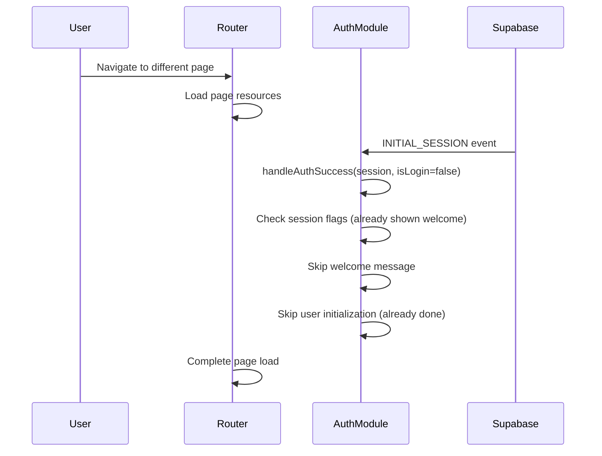

# 🔐 AudioBook Creator - Authentication Flow & Implementation Guide

## Table of Contents
1. [Overview](#overview)
2. [Architecture](#architecture)
3. [Authentication Flow](#authentication-flow)
4. [Session Management](#session-management)
5. [Router Integration](#router-integration)
6. [Creating New Pages](#creating-new-pages)
7. [Code Examples](#code-examples)
8. [Best Practices](#best-practices)
9. [Troubleshooting](#troubleshooting)

---

## Overview

The AudioBook Creator uses a sophisticated authentication system built on **Supabase Auth** with custom session management, JWT token handling, and seamless page navigation. The system is designed to provide a smooth user experience with minimal authentication overhead.

### Key Features
- ✅ JWT-based authentication with Supabase
- ✅ Singleton AuthModule for consistent state
- ✅ Persistent session management across page navigation
- ✅ Smart welcome message handling
- ✅ Automatic route protection
- ✅ Credits system integration
- ✅ Password reset flow
- ✅ Session restoration without re-authentication

---

## Architecture

### Core Components

```
┌─────────────────┐    ┌─────────────────┐    ┌─────────────────┐
│   AuthModule    │◄──►│ SessionManager  │◄──►│     Router      │
│   (Singleton)   │    │                 │    │                 │
└─────────────────┘    └─────────────────┘    └─────────────────┘
         │                       │                       │
         ▼                       ▼                       ▼
┌─────────────────┐    ┌─────────────────┐    ┌─────────────────┐
│ Supabase Client │    │   LocalStorage  │    │   Page Loader   │
│                 │    │                 │    │                 │
└─────────────────┘    └─────────────────┘    └─────────────────┘
```

### File Structure
```
frontend/
├── js/modules/
│   ├── auth.js              # Core authentication module
│   ├── sessionManager.js    # Session state management
│   ├── router.js           # Route handling & auth integration
│   └── notifications.js    # User feedback system
├── pages/
│   ├── auth/               # Authentication pages
│   │   ├── auth.html       # Login/signup forms
│   │   ├── auth.js         # Auth page logic
│   │   └── main.js         # Auth page entry point
│   ├── app/                # Main application
│   └── landing/            # Public landing page
└── css/
    └── auth.css            # Authentication styling
```

---

## Authentication Flow

### 1. Initial App Load


### 2. Login Process


### 3. Page Navigation (Session Restoration)



---

## Session Management

### Session Persistence Strategy

The system uses a multi-layered approach to maintain session state:

#### 1. AuthModule State (Runtime)
```javascript
class AuthModule {
    constructor() {
        this.user = null;                    // Current user object
        this.session = null;                 // Supabase session
        this.sessionId = null;               // Unique session identifier
        this.welcomeShownThisSession = false; // Welcome message flag
        this.userInitialized = false;        // User data loaded flag
        this.newUserCreditsShown = false;    // New user credits flag
    }
}
```

#### 2. LocalStorage Persistence
```javascript
// Session flags stored in localStorage
{
    "sessionId": "abc123def456",
    "welcomeShownThisSession": true,
    "userInitialized": true,
    "newUserCreditsShown": false,
    "timestamp": 1699123456789
}
```

#### 3. Supabase Session Storage
Supabase automatically handles JWT token storage and refresh in browser storage.

### Session Flag Management

```javascript
// Save session flags after important events
saveSessionFlags() {
    const sessionData = {
        sessionId: this.sessionId,
        welcomeShownThisSession: this.welcomeShownThisSession,
        userInitialized: this.userInitialized,
        newUserCreditsShown: this.newUserCreditsShown,
        timestamp: Date.now()
    };
    localStorage.setItem('auth_session_data', JSON.stringify(sessionData));
}

// Restore session flags on app initialization
restoreSessionFlags() {
    const sessionData = localStorage.getItem('auth_session_data');
    if (sessionData) {
        const data = JSON.parse(sessionData);
        // Only restore if within 24 hours
        if (Date.now() - data.timestamp < 24 * 60 * 60 * 1000) {
            this.welcomeShownThisSession = data.welcomeShownThisSession || false;
            this.userInitialized = data.userInitialized || false;
            this.newUserCreditsShown = data.newUserCreditsShown || false;
        }
    }
}
```

---

## Router Integration

### Route Configuration

```javascript
const routeConfig = {
    '/': { component: 'landing', requiresAuth: false },
    '/auth': { component: 'auth', requiresAuth: false },
    '/app': { component: 'app', requiresAuth: true },
    '/profile': { component: 'profile', requiresAuth: true },
    '/auth/reset-password': { component: 'reset-password', requiresAuth: false }
};
```

### Authentication Guards

```javascript
// Route handling with auth checks
async handleRoute(path = null, state = {}) {
    const route = routeConfig[targetPath];
    const isAuthenticated = sessionManager.isAuthenticated;
    
    // Protect authenticated routes
    if (route.requiresAuth && !isAuthenticated) {
        showInfo('Please sign in to access this page');
        await this.navigate('/auth');
        return;
    }
    
    // Redirect authenticated users from auth page
    if (targetPath === '/auth' && isAuthenticated && !isPasswordRecovery) {
        await this.navigate('/app');
        return;
    }
    
    await this.loadRoute(route);
}
```

### Page Loading Pattern

Each page follows this loading pattern:

```javascript
async loadAuthPage() {
    // 1. Clean up previous page resources
    this.cleanupExistingResources();
    
    // 2. Load required CSS
    this.ensureStylesLoaded(['auth.css']);
    
    // 3. Fetch and inject HTML
    const html = await fetch('/pages/auth/auth.html');
    appContainer.innerHTML = await html.text();
    
    // 4. Set body class for styling
    document.body.className = 'auth-body app-ready';
    
    // 5. Load page-specific JavaScript
    const script = this.loadScript('/pages/auth/main.js');
}
```

---

## Creating New Pages

### Step-by-Step Guide

#### 1. Create Page Structure

```
frontend/pages/your-page/
├── your-page.html      # Page template
├── your-page.js        # Page logic
├── main.js            # Page entry point
└── your-page.css      # Page styles (optional)
```

#### 2. Add Route Configuration

```javascript
// In router.js
const routeConfig = {
    // ... existing routes
    '/your-page': { 
        component: 'your-page', 
        requiresAuth: true,  // Set based on your needs
        title: 'Your Page Title'
    }
};
```

#### 3. Implement Page Loader

```javascript
// In router.js - Add to loadRoute() method
async loadRoute(route) {
    switch (route.component) {
        // ... existing cases
        case 'your-page':
            await this.loadYourPage();
            break;
    }
}

// Add page loader method
async loadYourPage() {
    try {
        const appContainer = document.getElementById('appContainer');
        
        // Clean up previous page
        this.cleanupExistingResources();
        
        // Load page CSS if needed
        this.ensureStylesLoaded(['your-page.css']);
        
        // Load HTML
        const response = await fetch('/pages/your-page/your-page.html');
        appContainer.innerHTML = await response.text();
        
        // Set body class
        document.body.className = 'your-page-body app-ready';
        
        // Load page script
        const script = document.createElement('script');
        script.type = 'module';
        script.src = '/pages/your-page/main.js';
        script.id = 'your-page-script';
        document.head.appendChild(script);
        
    } catch (error) {
        console.error('Error loading your page:', error);
        showError('Failed to load page');
    }
}
```

#### 4. Create Page Entry Point

```javascript
// your-page/main.js
import { initYourPage } from './your-page.js';

function initialize() {
    // Use global auth module initialized by router
    if (window.authModule) {
        initYourPage(window.authModule);
    } else {
        console.error('Auth module not available');
    }
}

if (document.readyState === 'loading') {
    document.addEventListener('DOMContentLoaded', initialize);
} else {
    initialize();
}
```

#### 5. Implement Page Logic

```javascript
// your-page/your-page.js
export async function initYourPage(authModule) {
    console.log('🚀 Initializing your page...');
    
    // Check authentication if needed
    if (!authModule.isAuthenticated()) {
        console.error('User not authenticated');
        return;
    }
    
    // Get current user
    const user = authModule.getCurrentUser();
    
    // Set up page functionality
    setupEventListeners();
    loadPageData();
    
    console.log('✅ Your page initialized');
}

function setupEventListeners() {
    // Your page-specific event listeners
}

async function loadPageData() {
    // Load data using authenticated API calls
    try {
        const response = await window.authModule.apiRequest('/api/your-endpoint');
        const data = await response.json();
        // Handle data
    } catch (error) {
        console.error('Failed to load data:', error);
    }
}
```

---

## Code Examples

### Making Authenticated API Calls

```javascript
// Using the auth module's apiRequest method
async function fetchUserData() {
    try {
        const response = await window.authModule.apiRequest('/api/user/profile', {
            method: 'GET'
        });
        
        if (response.ok) {
            const userData = await response.json();
            return userData;
        } else {
            throw new Error('Failed to fetch user data');
        }
    } catch (error) {
        console.error('API call failed:', error);
        showError('Failed to load user data');
    }
}
```

### Checking Authentication State

```javascript
// Check if user is authenticated
if (window.authModule && window.authModule.isAuthenticated()) {
    // User is logged in
    const user = window.authModule.getCurrentUser();
    displayUserInfo(user);
} else {
    // User is not logged in
    redirectToLogin();
}
```

### Handling Authentication Events

```javascript
// Listen for auth state changes
window.addEventListener('auth-state-changed', (event) => {
    const { isAuthenticated, user } = event.detail;
    
    if (isAuthenticated) {
        console.log('User logged in:', user.email);
        updateUIForAuthenticatedUser(user);
    } else {
        console.log('User logged out');
        updateUIForUnauthenticatedUser();
    }
});
```

### Creating Protected Content

```javascript
function initializeProtectedFeature() {
    if (!window.authModule?.isAuthenticated()) {
        showInfo('Please sign in to access this feature');
        window.router?.navigate('/auth');
        return;
    }
    
    // Initialize protected feature
    setupProtectedUI();
}
```

---

## Best Practices

### 1. Authentication Checks

**✅ Do:**
```javascript
// Always check authentication before accessing protected features
if (window.authModule?.isAuthenticated()) {
    // Safe to proceed
}
```

**❌ Don't:**
```javascript
// Don't assume user is authenticated
const user = window.authModule.getCurrentUser(); // Might be null
```

### 2. API Calls

**✅ Do:**
```javascript
// Use the auth module's apiRequest for automatic token handling
const response = await window.authModule.apiRequest('/api/endpoint');
```

**❌ Don't:**
```javascript
// Don't manually handle auth tokens
const token = localStorage.getItem('auth_token');
fetch('/api/endpoint', {
    headers: { 'Authorization': `Bearer ${token}` }
});
```

### 3. Page Navigation

**✅ Do:**
```javascript
// Use the router for navigation
window.router?.navigate('/app');
```

**❌ Don't:**
```javascript
// Don't use direct navigation without auth checks
window.location.href = '/app';
```

### 4. Error Handling

**✅ Do:**
```javascript
try {
    const response = await window.authModule.apiRequest('/api/endpoint');
    // Handle response
} catch (error) {
    if (error.message === 'Authentication required') {
        // Auth module automatically handles token refresh/redirect
        return;
    }
    // Handle other errors
}
```

### 5. Clean Up

**✅ Do:**
```javascript
// Clean up page-specific resources when leaving
function cleanup() {
    // Remove event listeners
    // Clear intervals/timeouts
    // Remove page-specific scripts
}
```

---

## Troubleshooting

### Common Issues

#### 1. Welcome Message Appearing Multiple Times

**Cause:** Session flags not properly persisted
**Solution:** Check localStorage and session tracking

```javascript
// Debug session flags
console.log('Session flags:', {
    welcomeShown: window.authModule.welcomeShownThisSession,
    userInit: window.authModule.userInitialized,
    sessionId: window.authModule.sessionId
});
```

#### 2. Authentication State Not Updating

**Cause:** Not listening to auth state changes
**Solution:** Add event listener

```javascript
window.addEventListener('auth-state-changed', handleAuthChange);
```

#### 3. API Calls Failing with 401

**Cause:** Token expired or missing
**Solution:** Use auth module's apiRequest method

```javascript
// This automatically handles token refresh
const response = await window.authModule.apiRequest('/api/endpoint');
```

#### 4. Page Not Loading After Navigation

**Cause:** Script conflicts or missing cleanup
**Solution:** Proper resource management

```javascript
// Clean up before loading new page
const existingScript = document.getElementById('page-script');
if (existingScript) existingScript.remove();
```

### Debug Commands

```javascript
// Check auth state
console.log('Auth state:', {
    isAuthenticated: window.authModule?.isAuthenticated(),
    user: window.authModule?.getCurrentUser(),
    token: window.authModule?.getAuthToken()
});

// Check session manager
console.log('Session manager:', {
    isAuthenticated: window.sessionManager?.isAuthenticated,
    user: window.sessionManager?.user
});

// Check router state
console.log('Router state:', {
    currentRoute: window.router?.currentRoute,
    isLoading: window.router?.isLoading
});
```

---

## Summary

The AudioBook Creator authentication system provides:

1. **Seamless User Experience:** Single login, persistent sessions
2. **Smart State Management:** Prevents duplicate operations
3. **Secure API Access:** Automatic token handling
4. **Flexible Architecture:** Easy to extend with new pages
5. **Robust Error Handling:** Graceful degradation

When creating new pages, follow the established patterns for authentication checks, API calls, and state management to ensure consistency and reliability.

---

**Remember:** Always test your new pages with both authenticated and unauthenticated users to ensure proper behavior in all scenarios.