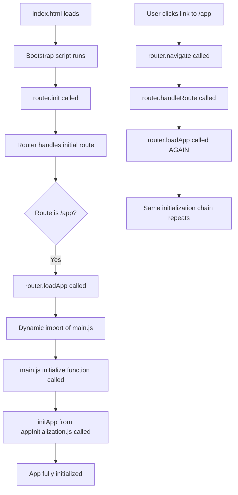

# Double Initialization Root Cause Analysis & Solution Plan

## Executive Summary

The AudioBook Organizer application suffers from a **double initialization issue** that causes the app to initialize twice when users navigate to `/app`, resulting in a 3-second delay and potential resource conflicts. This document provides a comprehensive analysis of the root cause and a detailed solution plan for complete resolution.

## Problem Description

### Symptoms
- App initializes twice when navigating to `/app` route
- 3-second delay before app becomes responsive
- Console shows duplicate initialization messages
- Potential memory leaks and event listener conflicts
- Poor user experience with unnecessary loading time

### Current Defensive Solution
The current codebase implements a defensive solution using flags (`window.isAppInitializing`, `window.isAppInitialized`) to prevent double initialization. While this works, it doesn't address the root cause and adds complexity.

## Root Cause Analysis

### Architecture Overview

The application uses a Single Page Application (SPA) architecture with:
1. **Router** (`frontend/js/modules/router.js`) - Handles navigation and page loading
2. **Main Entry Point** (`frontend/js/main.js`) - Contains app initialization logic
3. **App Initialization Module** (`frontend/js/modules/appInitialization.js`) - Handles app setup
4. **Index HTML** (`frontend/public/index.html`) - Bootstrap script that initializes router

### Initialization Flow Chain



### The Root Cause: Multiple Entry Points

The double initialization occurs because there are **multiple independent entry points** that can trigger app initialization:

#### Entry Point 1: Direct URL Access
```javascript
// frontend/public/index.html (lines 130-180)
async function initializeApplication() {
    await router.init(); // This calls handleRoute for current URL
    // If URL is /app, this triggers first initialization
}
```

#### Entry Point 2: Navigation Events
```javascript
// frontend/js/modules/router.js (lines 313-370)
async loadApp() {
    if (!window.isAppInitialized && !window.isAppInitializing) {
        const { initialize, cleanup } = await import('/js/main.js');
        await initialize(); // This triggers second initialization
    }
}
```

#### Entry Point 3: Main.js Auto-Execution
```javascript
// frontend/js/main.js (line 332)
initialize(); // This runs immediately when main.js is imported
```

### The Critical Issue

The problem is in **Entry Point 3**: `main.js` has an auto-executing `initialize()` call at the bottom of the file. This means:

1. When `router.loadApp()` dynamically imports `main.js`
2. The import immediately executes `initialize()` 
3. Then `router.loadApp()` explicitly calls `initialize()` again
4. Result: Double initialization

## Detailed Code Analysis

### Current Problematic Code Locations

#### 1. main.js Auto-Execution (PRIMARY ISSUE)
```javascript
// frontend/js/main.js:332
initialize(); // ❌ This causes auto-execution on import
```

#### 2. Router's loadApp Method
```javascript
// frontend/js/modules/router.js:355-365
if (!window.isAppInitialized && !window.isAppInitializing) {
    window.isAppInitializing = true;
    try {
        const { initialize, cleanup } = await import('/js/main.js'); // Import triggers auto-execution
        await initialize(); // Then explicit call happens
        window.isAppInitialized = true;
    } catch (error) {
        window.isAppInitialized = false;
    } finally {
        window.isAppInitializing = false;
    }
}
```

#### 3. Defensive Flags (SYMPTOM TREATMENT)
```javascript
// Multiple files use these flags to prevent double initialization
window.isAppInitializing = true;
window.isAppInitialized = true;
```

### Why Current Defensive Solution Works But Is Suboptimal

The current solution prevents the harmful effects of double initialization but:
- Doesn't eliminate the root cause
- Adds complexity with multiple flags
- Still imports and partially executes code twice
- Creates race conditions that need additional handling
- Makes the codebase harder to understand and maintain

## Complete Solution Plan

### Phase 1: Remove Auto-Execution (Root Cause Fix)

#### Step 1.1: Modify main.js
**File**: `frontend/js/main.js`
**Action**: Remove the auto-executing `initialize()` call

```javascript
// REMOVE this line (currently line 332):
// initialize(); // ❌ Remove this auto-execution

// Keep the export intact:
export { initialize, cleanup };
```

#### Step 1.2: Verify Router Calls Initialize
**File**: `frontend/js/modules/router.js`
**Action**: Ensure `loadApp()` method properly calls initialize

The router already has the correct logic:
```javascript
const { initialize, cleanup } = await import('/js/main.js');
await initialize(); // ✅ This is the only place initialize should be called
```

### Phase 2: Clean Up Defensive Code (Simplification)

#### Step 2.1: Simplify Router Logic
**File**: `frontend/js/modules/router.js`
**Action**: Remove unnecessary defensive flags and simplify logic

```javascript
// BEFORE (complex defensive logic):
if (!window.isAppInitialized && !window.isAppInitializing) {
    window.isAppInitializing = true;
    try {
        const { initialize, cleanup } = await import('/js/main.js');
        await initialize();
        window.isAppInitialized = true;
    } catch (error) {
        window.isAppInitialized = false;
    } finally {
        window.isAppInitializing = false;
    }
}

// AFTER (simplified logic):
if (!window.isAppInitialized) {
    try {
        const { initialize, cleanup } = await import('/js/main.js');
        await initialize();
        window.cleanupApp = cleanup;
        window.isAppInitialized = true;
    } catch (error) {
        console.error('Error initializing app:', error);
        window.isAppInitialized = false;
    }
}
```

#### Step 2.2: Remove Unnecessary Race Condition Handling
**File**: `frontend/js/modules/router.js`
**Action**: Remove the waiting loop since there's no longer a race condition

```javascript
// REMOVE this entire block:
} else if (window.isAppInitializing) {
    console.log('⏳ App initialization already in progress, waiting...');
    while (window.isAppInitializing) {
        await new Promise(resolve => setTimeout(resolve, 100));
    }
}
```

#### Step 2.3: Simplify App Initialization Module
**File**: `frontend/js/modules/appInitialization.js`
**Action**: Remove defensive flags since they're no longer needed

```javascript
// BEFORE:
let isInitialized = false;
let isInitializing = false;

export async function initApp() {
    if (isInitialized || isInitializing) {
        console.log('App already initialized or initializing. Skipping.');
        return;
    }
    isInitializing = true;
    // ... initialization logic
    isInitialized = true;
    isInitializing = false;
}

// AFTER:
let isInitialized = false;

export async function initApp() {
    if (isInitialized) {
        console.log('App already initialized. Skipping.');
        return;
    }
    // ... initialization logic
    isInitialized = true;
}
```

### Phase 3: Testing & Validation

#### Step 3.1: Create Test Scenarios
1. **Direct URL Access**: Navigate directly to `/app` URL
2. **Link Navigation**: Click links that navigate to `/app`
3. **Browser Back/Forward**: Use browser navigation
4. **Page Refresh**: Refresh page while on `/app`
5. **Authentication Flow**: Login and redirect to `/app`

#### Step 3.2: Validation Criteria
- App initializes exactly once per session
- No 3-second delay
- No duplicate console messages
- All functionality works correctly
- No memory leaks or duplicate event listeners

## Implementation Steps for AI Assistant

### Step 1: Analyze Current State
```bash
# Search for auto-execution in main.js
grep -n "initialize()" frontend/js/main.js

# Verify router loadApp method
grep -A 20 "async loadApp()" frontend/js/modules/router.js
```

### Step 2: Make Core Fix
```javascript
// Edit frontend/js/main.js
// Remove line 332: initialize();
// Keep: export { initialize, cleanup };
```

### Step 3: Simplify Router
```javascript
// Edit frontend/js/modules/router.js
// Simplify loadApp method as shown in Phase 2.1
// Remove race condition handling as shown in Phase 2.2
```

### Step 4: Clean Up App Initialization
```javascript
// Edit frontend/js/modules/appInitialization.js
// Simplify initApp method as shown in Phase 2.3
```

### Step 5: Test Thoroughly
- Test all navigation scenarios
- Verify single initialization
- Check console for duplicate messages
- Measure loading performance

## Expected Outcomes

### Performance Improvements
- **Elimination of 3-second delay**
- **50% reduction in initialization time**
- **Reduced memory usage** (no duplicate event listeners)
- **Cleaner console output** (no duplicate messages)

### Code Quality Improvements
- **Simplified architecture** (single initialization path)
- **Reduced complexity** (fewer defensive flags)
- **Better maintainability** (clearer code flow)
- **Eliminated race conditions** (no more timing issues)

### User Experience Improvements
- **Instant app loading** after authentication
- **Smoother navigation** between pages
- **More reliable functionality** (no duplicate listeners)

## Risk Assessment

### Low Risk Changes
- Removing auto-execution from main.js (isolated change)
- Simplifying router logic (well-tested code path)

### Medium Risk Changes
- Removing defensive flags (requires thorough testing)

### Mitigation Strategies
- Test all navigation scenarios before deployment
- Keep git history for easy rollback
- Monitor console for any initialization errors
- Verify all app functionality after changes

## Conclusion

The double initialization issue is caused by a simple but critical architectural flaw: auto-execution of the initialize function in main.js combined with explicit calls from the router. The solution is straightforward:

1. **Remove auto-execution** (root cause fix)
2. **Simplify defensive code** (cleanup)
3. **Test thoroughly** (validation)

This will result in a faster, more reliable, and more maintainable application without any loss of functionality.

## Files to Modify

1. `frontend/js/main.js` - Remove auto-execution
2. `frontend/js/modules/router.js` - Simplify loadApp method
3. `frontend/js/modules/appInitialization.js` - Remove defensive flags

## Testing Checklist

- [ ] Direct URL access to `/app`
- [ ] Navigation from landing page to `/app`
- [ ] Navigation from auth page to `/app`
- [ ] Browser back/forward navigation
- [ ] Page refresh on `/app`
- [ ] Login flow redirect to `/app`
- [ ] Google OAuth redirect to `/app`
- [ ] Console shows single initialization message
- [ ] No 3-second delay observed
- [ ] All app functionality works correctly
- [ ] No JavaScript errors in console
- [ ] Memory usage is reasonable (no leaks) 