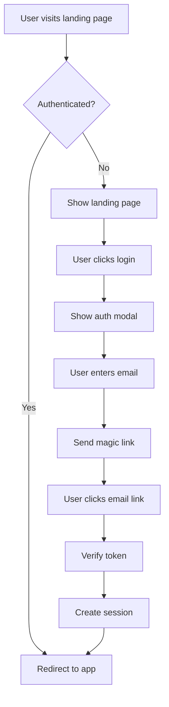

# Landing Page & Authentication Integration Documentation

## 📋 Overview

This document outlines the complete integration plan for adding a modern landing page with Supabase authentication to the AudioBook Organizer project. The integration maintains the existing modular architecture while adding user authentication, session management, and preparation for future payment systems.

## 🏗️ Architecture Overview

### Current State
- **Frontend**: Vanilla JavaScript with modular ES6 architecture
- **Backend**: Python Flask with modular structure
- **Authentication**: None (direct application access)
- **State Management**: Centralized state in `state.js`

### Target State
- **Frontend**: Extended modular architecture with routing and auth
- **Backend**: Flask + Supabase integration
- **Authentication**: Supabase with magic link login
- **State Management**: Extended to include user session and credits
- **Routing**: Client-side routing for multiple pages

## 🎯 Implementation Phases

### Phase 1: Landing Page Foundation
**Goal**: Create a modern, responsive landing page that showcases the AudioBook Organizer features.

#### 1.1 File Structure
```
frontend/
├── pages/
│   ├── landing/
│   │   ├── landing.html          # Landing page content
│   │   ├── landing.css           # Landing-specific styles
│   │   └── landing.js            # Landing page functionality
│   ├── auth/
│   │   ├── auth.html             # Authentication forms
│   │   ├── auth.css              # Auth-specific styles
│   │   └── auth.js               # Auth functionality
│   └── app/
│       └── app.html              # Current audiobook app (refactored)
├── js/
│   ├── modules/
│   │   ├── router.js             # Client-side routing
│   │   ├── auth.js               # Authentication logic
│   │   ├── userSession.js        # Session management
│   │   ├── landingUI.js          # Landing page UI components
│   │   └── [existing modules]    # All current modules preserved
│   └── main.js                   # Updated entry point
└── css/
    ├── landing.css               # Landing page styles
    ├── auth.css                  # Authentication styles
    └── [existing CSS files]      # All current styles preserved
```

#### 1.2 Landing Page Components
- **Hero Section**: Value proposition with call-to-action
- **Features Showcase**: Interactive demonstration of key features
- **How It Works**: Step-by-step process explanation
- **Testimonials/Social Proof**: User feedback section
- **Pricing Preview**: Foundation for future payment integration
- **Footer**: Links and additional information

#### 1.3 Design System Extensions
```css
/* New CSS variables for landing page */
:root {
    /* Extend existing color palette */
    --landing-hero-bg: linear-gradient(135deg, #667eea 0%, #764ba2 100%);
    --landing-card-bg: rgba(255, 255, 255, 0.95);
    --landing-text-hero: #ffffff;
    --landing-accent: #4CAF50;
    
    /* Animation variables */
    --animation-duration: 0.3s;
    --animation-ease: cubic-bezier(0.4, 0, 0.2, 1);
    
    /* Spacing for landing */
    --landing-section-padding: 80px 0;
    --landing-container-max-width: 1200px;
}
```

### Phase 2: Routing System
**Goal**: Implement client-side routing to handle multiple pages seamlessly.

#### 2.1 Router Module (`frontend/js/modules/router.js`)
```javascript
// Route definitions
const routes = {
    '/': 'landing',
    '/auth': 'auth', 
    '/app': 'app',
    '/profile': 'profile'
};

// Router functionality
- URL-based navigation
- Browser history management
- Dynamic content loading
- Protected route handling
```

#### 2.2 Route Protection
- **Public Routes**: Landing page, authentication
- **Protected Routes**: AudioBook application, user profile
- **Redirect Logic**: Unauthenticated users → landing page
- **Session Persistence**: Maintain state across page reloads

### Phase 3: Supabase Authentication
**Goal**: Implement secure, passwordless authentication using Supabase.

#### 3.1 Supabase Project Setup
```
1. Create Supabase Project
2. Configure Authentication Settings
3. Set up Magic Link Authentication
4. Create User Profiles Table
5. Configure Row Level Security (RLS)
```

#### 3.2 Authentication Flow


#### 3.3 Authentication Module Structure
```javascript
// frontend/js/modules/auth.js
export const authModule = {
    // Core authentication methods
    signInWithMagicLink(email),
    signOut(),
    getCurrentUser(),
    
    // Session management
    checkAuthStatus(),
    refreshSession(),
    handleAuthRedirect(),
    
    // User profile management
    getUserProfile(),
    updateUserProfile(data),
    
    // Event handling
    onAuthStateChange(callback)
};
```

### Phase 4: Backend Integration
**Goal**: Extend Flask backend to work with Supabase authentication.

#### 4.1 Backend Authentication Middleware
```python
# backend/middleware/auth_middleware.py
class SupabaseAuthMiddleware:
    """
    Middleware to verify Supabase JWT tokens
    and protect API endpoints
    """
    def verify_token(self, token)
    def get_user_from_token(self, token)
    def require_auth(self, f)  # Decorator for protected routes
```

#### 4.2 User Management Service
```python
# backend/services/user_service.py
class UserService:
    """
    Service for user-related operations
    """
    def get_user_profile(self, user_id)
    def update_user_profile(self, user_id, data)
    def get_user_usage_stats(self, user_id)
    def check_user_credits(self, user_id)
```

#### 4.3 Protected API Routes
- All existing audiobook functionality requires authentication
- User-specific data isolation
- Usage tracking for future credit system

### Phase 5: State Management Evolution
**Goal**: Extend current state management to handle user sessions and authentication.

#### 5.1 Extended State Structure
```javascript
// frontend/js/modules/state.js - Enhanced
export let authState = {
    user: null,
    session: null,
    isAuthenticated: false,
    isLoading: false
};

export let userState = {
    profile: null,
    credits: 0,
    usageStats: null,
    preferences: {}
};

// Existing audiobook state preserved
export let bookText = '';
export let chapters = [];
// ... all existing state variables
```

#### 5.2 State Synchronization
- Authentication state changes trigger UI updates
- User data syncs with Supabase
- Local storage for session persistence
- Real-time updates for collaborative features (future)

### Phase 6: UI/UX Integration
**Goal**: Create seamless transitions between landing page and application.

#### 6.1 Navigation Components
```javascript
// Shared navigation component
const NavigationComponent = {
    // Public navigation (landing page)
    renderPublicNav(),
    
    // Authenticated navigation (app)
    renderAuthenticatedNav(),
    
    // Auth status indicator
    renderAuthStatus(),
    
    // Profile dropdown
    renderProfileDropdown()
};
```

#### 6.2 Modal System Enhancement
- Authentication modals
- User profile settings
- Confirmation dialogs
- Loading states

## 🔧 Technical Specifications

### Supabase Configuration

#### Database Schema
```sql
-- Users table (handled by Supabase Auth)
-- Additional profile information
CREATE TABLE profiles (
    id UUID REFERENCES auth.users ON DELETE CASCADE,
    username TEXT,
    full_name TEXT,
    avatar_url TEXT,
    created_at TIMESTAMP WITH TIME ZONE DEFAULT NOW(),
    updated_at TIMESTAMP WITH TIME ZONE DEFAULT NOW(),
    
    PRIMARY KEY (id)
);

-- Credits system (future)
CREATE TABLE user_credits (
    user_id UUID REFERENCES profiles(id) ON DELETE CASCADE,
    credits INTEGER DEFAULT 0,
    last_updated TIMESTAMP WITH TIME ZONE DEFAULT NOW(),
    
    PRIMARY KEY (user_id)
);

-- Usage tracking (future)
CREATE TABLE usage_logs (
    id UUID DEFAULT gen_random_uuid(),
    user_id UUID REFERENCES profiles(id) ON DELETE CASCADE,
    action TEXT NOT NULL,
    credits_used INTEGER DEFAULT 0,
    created_at TIMESTAMP WITH TIME ZONE DEFAULT NOW(),
    
    PRIMARY KEY (id)
);
```

#### Row Level Security (RLS)
```sql
-- Enable RLS
ALTER TABLE profiles ENABLE ROW LEVEL SECURITY;
ALTER TABLE user_credits ENABLE ROW LEVEL SECURITY;
ALTER TABLE usage_logs ENABLE ROW LEVEL SECURITY;

-- Policies
CREATE POLICY "Users can view own profile" 
    ON profiles FOR SELECT 
    USING (auth.uid() = id);

CREATE POLICY "Users can update own profile" 
    ON profiles FOR UPDATE 
    USING (auth.uid() = id);
```

### Environment Configuration

#### Frontend Environment Variables
```javascript
// frontend/js/config/supabase.js
export const supabaseConfig = {
    url: process.env.SUPABASE_URL || 'your-supabase-url',
    anonKey: process.env.SUPABASE_ANON_KEY || 'your-anon-key'
};
```

#### Backend Environment Variables
```python
# backend/config.py - Enhanced
class Config:
    # Existing configuration...
    
    # Supabase configuration
    SUPABASE_URL = os.environ.get('SUPABASE_URL')
    SUPABASE_KEY = os.environ.get('SUPABASE_SERVICE_KEY')
    SUPABASE_JWT_SECRET = os.environ.get('SUPABASE_JWT_SECRET')
```

## 🎨 Design Guidelines

### Visual Consistency
- Maintain existing color palette and extend for landing page
- Use current 8-color section system for branding elements
- Preserve existing component styling patterns
- Add subtle animations and micro-interactions

### Responsive Design
- Mobile-first approach
- Breakpoints: 320px, 768px, 1024px, 1440px
- Touch-friendly interactions
- Optimized loading for mobile networks

### Accessibility
- WCAG 2.1 AA compliance
- Keyboard navigation support
- Screen reader compatibility
- High contrast mode support

## 🔒 Security Considerations

### Authentication Security
- Magic link expiration (15 minutes)
- Session timeout handling
- CSRF protection
- XSS prevention

### Data Protection
- User data encryption
- Secure API endpoints
- Input validation and sanitization
- Rate limiting

### Privacy Compliance
- GDPR-ready data handling
- User data export/deletion
- Cookie consent management
- Privacy policy integration

## 🚀 Deployment Strategy

### Development Environment
```bash
# Frontend development
npm run dev:landing    # Landing page development
npm run dev:app       # Current app development
npm run dev:full      # Full application

# Backend development
python app.py         # Current Flask server
```

### Production Deployment
- Static asset optimization
- CDN integration for better performance
- Environment-specific configurations
- Database migration scripts

## 📊 Performance Considerations

### Loading Strategy
- Critical CSS inlining for landing page
- Progressive loading of app modules
- Image optimization and lazy loading
- Service worker for caching (future PWA)

### Bundle Optimization
- Module splitting for better caching
- Tree shaking for unused code elimination
- Compression for production builds
- HTTP/2 optimization

## 🧪 Testing Strategy

### Unit Testing
- Authentication module testing
- Router functionality testing
- State management testing
- UI component testing

### Integration Testing
- Supabase integration testing
- Authentication flow testing
- Protected route testing
- Session management testing

### E2E Testing
- Complete user journey testing
- Cross-browser compatibility
- Mobile responsiveness testing
- Performance testing

## 📈 Future Enhancements

### Payment System Integration
- Stripe integration for subscriptions
- PayPal alternative payment method
- Credit system implementation
- Usage-based billing

### Advanced Features
- Real-time collaboration
- Advanced analytics
- API rate limiting
- Mobile app development

### Scalability Improvements
- Microservices architecture
- Containerization
- Auto-scaling capabilities
- Performance monitoring

## 📝 Migration Guide

### From Current State
1. **Backup current application**
2. **Implement router and landing page**
3. **Add authentication layer**
4. **Migrate existing features to protected routes**
5. **Test all functionality**
6. **Deploy and monitor**

### Data Migration
- No existing user data to migrate
- Preserve existing audiobook data structure
- Ensure backward compatibility
- Gradual feature rollout

## 🔗 External Dependencies

### New Dependencies
```json
{
  "dependencies": {
    "@supabase/supabase-js": "^2.x.x",
    "js-cookie": "^3.x.x"
  },
  "devDependencies": {
    "jest": "^29.x.x",
    "cypress": "^13.x.x"
  }
}
```

### Python Dependencies
```txt
# requirements.txt additions
supabase>=1.0.0
python-jose[cryptography]>=3.0.0
```

## 📞 Support and Maintenance

### Documentation Updates
- Keep this document updated with implementation changes
- Maintain API documentation
- Update deployment guides
- Document troubleshooting procedures

### Monitoring and Alerts
- Authentication failure monitoring
- Performance metrics tracking
- Error logging and alerting
- User behavior analytics

---

## 🎯 Implementation Checklist

### Phase 1: Landing Page ✅ COMPLETED
- [x] Create landing page HTML structure
- [x] Implement responsive CSS
- [x] Add interactive components
- [x] Integrate with existing design system
- [x] Test cross-browser compatibility
- [x] Fix DOM initialization and routing issues
- [x] Implement dynamic element creation and error handling

### Phase 2: Routing System
- [ ] Implement client-side router
- [ ] Create route definitions
- [ ] Add navigation components
- [ ] Test route transitions
- [ ] Handle browser history

### Phase 3: Authentication
- [ ] Set up Supabase project
- [ ] Configure authentication settings
- [ ] Implement auth modules
- [ ] Create user profile system
- [ ] Test authentication flows

### Phase 4: Integration
- [ ] Connect backend with Supabase
- [ ] Implement protected routes
- [ ] Add session management
- [ ] Test complete user journey
- [ ] Performance optimization

### Phase 5: Testing & Deployment
- [ ] Comprehensive testing
- [ ] Security audit
- [ ] Performance optimization
- [ ] Production deployment
- [ ] Monitoring setup

---

*This documentation serves as the single source of truth for the AudioBook Organizer landing page and authentication integration project. It should be updated as implementation progresses and requirements evolve.* 