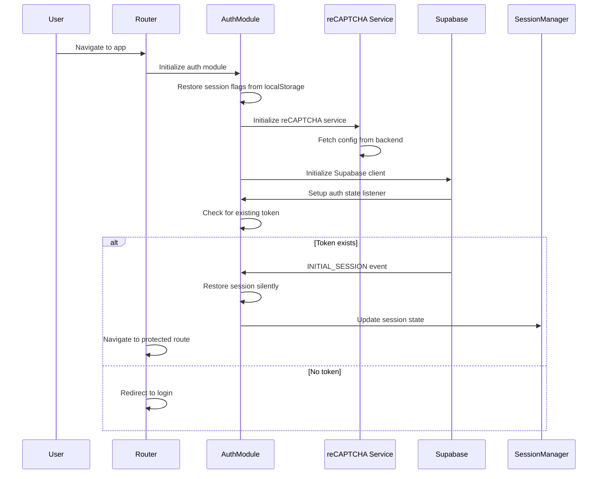
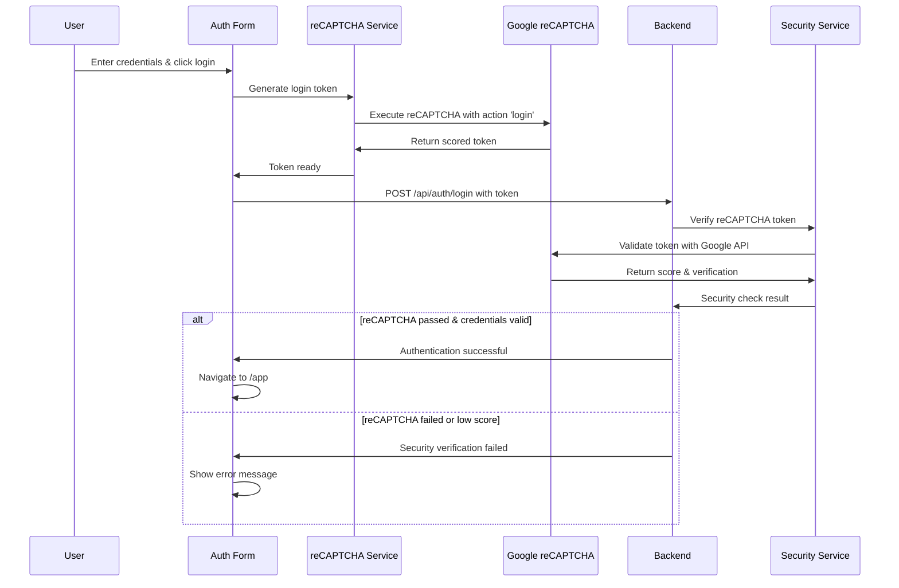
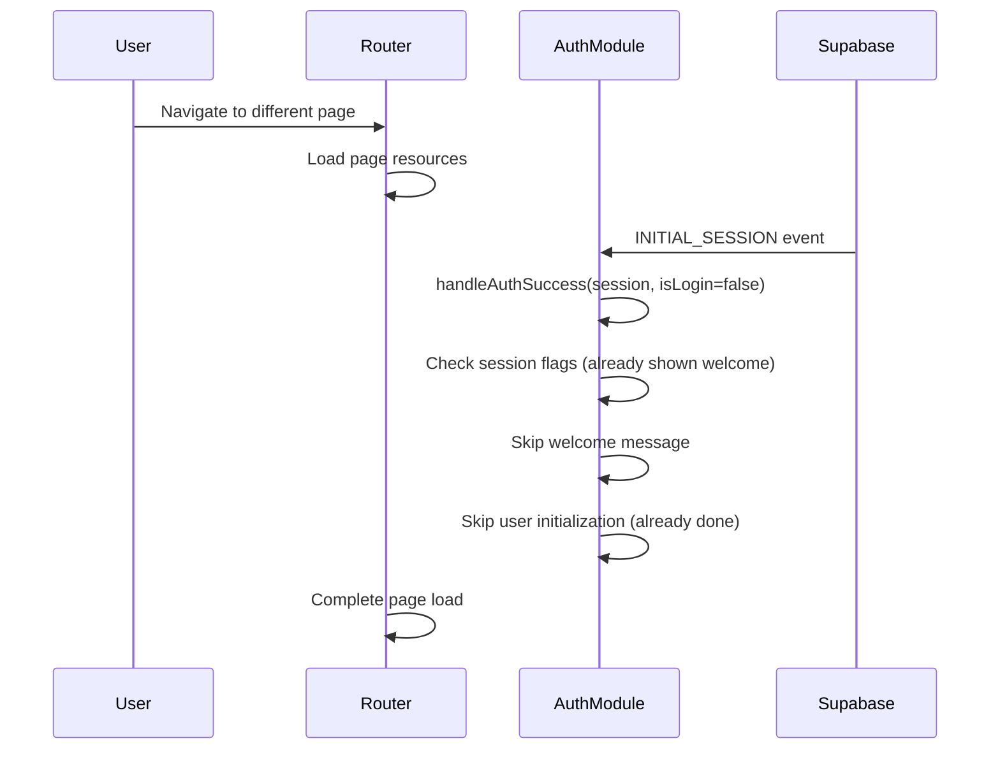

# 🔐 AudioBook Creator - Authentication Flow & Implementation Guide

## Table of Contents
1. [Overview](#overview)
2. [Architecture](#architecture)
3. [Authentication Flow](#authentication-flow)
4. [reCAPTCHA Integration](#recaptcha-integration)
5. [Session Management](#session-management)
6. [Router Integration](#router-integration)
7. [Creating New Pages](#creating-new-pages)
8. [Code Examples](#code-examples)
9. [Best Practices](#best-practices)
10. [Troubleshooting](#troubleshooting)

---

## Overview

The AudioBook Creator uses a sophisticated authentication system built on **Supabase Auth** with custom session management, JWT token handling, **reCAPTCHA v3 bot protection**, and seamless page navigation. The system is designed to provide a smooth user experience with minimal authentication overhead while maintaining high security standards.

### Key Features
- ✅ JWT-based authentication with Supabase
- ✅ **reCAPTCHA v3 invisible bot protection**
- ✅ Singleton AuthModule for consistent state
- ✅ Persistent session management across page navigation
- ✅ Smart welcome message handling
- ✅ Automatic route protection
- ✅ Credits system integration
- ✅ **Enhanced password reset flow with security fixes**
- ✅ Session restoration without re-authentication
- ✅ **Cross-tab security synchronization**
- ✅ **Supabase popstate event isolation**
- ✅ **Multi-layer same-tab detection**

---

## Architecture

### Core Components

```
┌─────────────────┐    ┌─────────────────┐    ┌─────────────────┐
│   AuthModule    │◄──►│ SessionManager  │◄──►│     Router      │
│   (Singleton)   │    │                 │    │                 │
└─────────────────┘    └─────────────────┘    └─────────────────┘
         │                       │                       │
         ▼                       ▼                       ▼
┌─────────────────┐    ┌─────────────────┐    ┌─────────────────┐
│ Supabase Client │    │   LocalStorage  │    │   Page Loader   │
│                 │    │                 │    │                 │
└─────────────────┘    └─────────────────┘    └─────────────────┘
         │
         ▼
┌─────────────────┐    ┌─────────────────┐    ┌─────────────────┐
│ reCAPTCHA v3    │◄──►│ Security Service│◄──►│ Google reCAPTCHA│
│    Service      │    │                 │    │       API       │
└─────────────────┘    └─────────────────┘    └─────────────────┘
```

### File Structure
```
frontend/
├── js/modules/
│   ├── auth.js              # Core authentication module
│   ├── recaptcha.js         # reCAPTCHA v3 service
│   ├── sessionManager.js    # Session state management
│   ├── router.js           # Route handling & auth integration
│   └── notifications.js    # User feedback system
├── pages/
│   ├── auth/               # Authentication pages
│   │   ├── auth.html       # Login/signup forms with reCAPTCHA
│   │   ├── auth.js         # Auth page logic with reCAPTCHA integration
│   │   └── main.js         # Auth page entry point
│   ├── app/                # Main application
│   └── landing/            # Public landing page
└── css/
    └── auth.css            # Authentication styling

backend/
├── services/
│   └── security_service.py  # reCAPTCHA verification & security
├── routes/
│   └── auth_routes.py       # Auth endpoints with reCAPTCHA validation
└── config.py               # Authentication & reCAPTCHA configuration
```

---

## Authentication Flow

### 1. Initial App Load



### 2. Login Process with reCAPTCHA



### 3. Page Navigation (Session Restoration)



---

## reCAPTCHA Integration

### Overview

AudioBook Creator uses **reCAPTCHA v3** for invisible bot protection. Unlike v2, reCAPTCHA v3:
- **Works invisibly** - no checkboxes or challenges
- **Analyzes user behavior** - mouse movements, typing patterns
- **Generates risk scores** - 0.0 (bot) to 1.0 (human)
- **Action-based tokens** - different tokens for login, signup, reset

### Frontend Implementation

#### reCAPTCHA Service (`frontend/js/modules/recaptcha.js`)

```javascript
class RecaptchaService {
    constructor() {
        this.siteKey = null;
        this.isEnabled = false;
        this.isLoaded = false;
    }

    /**
     * Initialize reCAPTCHA service
     */
    async init() {
        try {
            // Fetch configuration from backend
            const response = await fetch('/api/auth/security-status');
            const data = await response.json();
            
            this.isEnabled = data.security_status.recaptcha_enabled;
            this.siteKey = data.security_status.recaptcha_site_key;

            if (this.isEnabled && this.siteKey) {
                await this.loadRecaptchaScript();
                console.log('✅ reCAPTCHA service initialized');
            } else {
                console.log('ℹ️ reCAPTCHA is disabled');
            }
        } catch (error) {
            console.error('❌ Failed to initialize reCAPTCHA:', error);
        }
    }

    /**
     * Load Google reCAPTCHA script dynamically
     */
    async loadRecaptchaScript() {
        return new Promise((resolve, reject) => {
            // Check if already loaded
            if (window.grecaptcha && window.grecaptcha.ready) {
                this.isLoaded = true;
                this.waitForRecaptcha().then(resolve).catch(reject);
                return;
            }

            // Remove existing script if any
            const existingScript = document.querySelector('script[src*="recaptcha"]');
            if (existingScript) {
                existingScript.remove();
                this.waitForRecaptcha().then(resolve).catch(reject);
                return;
            }

            // Create and inject new script
            const script = document.createElement('script');
            script.src = `https://www.google.com/recaptcha/api.js?render=${this.siteKey}`;
            script.async = true;
            script.defer = true;
            
            script.onload = () => {
                this.waitForRecaptcha().then(resolve).catch(reject);
            };
            
            script.onerror = () => {
                reject(new Error('Failed to load reCAPTCHA script'));
            };
            
            document.head.appendChild(script);
        });
    }

    /**
     * Execute reCAPTCHA for a specific action
     */
    async executeRecaptcha(action) {
        if (!this.isEnabled) {
            console.log('ℹ️ reCAPTCHA disabled, returning dummy token');
            return 'disabled_token';
        }

        if (!this.siteKey) {
            throw new Error('reCAPTCHA site key not configured');
        }

        try {
            const token = await new Promise((resolve, reject) => {
                window.grecaptcha.execute(this.siteKey, { action })
                    .then(resolve)
                    .catch(reject);
            });
            console.log(`✅ reCAPTCHA token generated for action: ${action}`);
            return token;
        } catch (error) {
            console.error('❌ reCAPTCHA execution failed:', error);
            throw error;
        }
    }

    /**
     * Get reCAPTCHA token for login
     */
    async getLoginToken() {
        try {
            return await this.executeRecaptcha('login');
        } catch (error) {
            console.error('Failed to get login reCAPTCHA token:', error);
            throw error;
        }
    }

    /**
     * Get reCAPTCHA token for signup
     */
    async getSignupToken() {
        try {
            return await this.executeRecaptcha('signup');
        } catch (error) {
            console.error('Failed to get signup reCAPTCHA token:', error);
            throw error;
        }
    }

    /**
     * Get reCAPTCHA token for password reset
     */
    async getForgotPasswordToken() {
        try {
            return await this.executeRecaptcha('forgot_password');
        } catch (error) {
            console.error('Failed to get forgot password reCAPTCHA token:', error);
            throw error;
        }
    }
}

// Create singleton instance
const recaptcha = new RecaptchaService();

// Auto-initialize when imported
recaptcha.init();

export { recaptcha };
```

#### Form Integration (`frontend/pages/auth/auth.js`)

```javascript
// Import reCAPTCHA service
import { recaptcha } from '../../js/modules/recaptcha.js';

/**
 * Handle login form submission with reCAPTCHA
 */
async function handleLoginSubmit(e) {
    e.preventDefault();
    if (isLoading) return;

    const email = emailInput.value.trim();
    const password = passwordInput.value;

    if (!validateLoginForm(email, password)) {
        return;
    }

    setLoading(true);

    try {
        // Generate reCAPTCHA token before submission
        console.log('🔐 Generating reCAPTCHA token...');
        const recaptchaToken = await recaptcha.getLoginToken();
        
        console.log('✅ reCAPTCHA token generated');

        // Create login data with reCAPTCHA token
        const loginData = {
            email: email,
            password: password,
            recaptcha_token: recaptchaToken
        };

        // Make the login request to backend API
        const response = await fetch('/api/auth/login', {
            method: 'POST',
            headers: { 'Content-Type': 'application/json' },
            body: JSON.stringify(loginData)
        });

        const result = await response.json();

        if (result.success) {
            console.log('✅ Sign in successful');
            // Handle successful login...
        } else {
            throw new Error(result.message || 'Login failed');
        }
        
    } catch (error) {
        console.error('❌ Sign in failed:', error);
        
        // Show user-friendly error messages
        const errorMessage = error.message || 'Sign in failed';
        
        if (errorMessage.includes('reCAPTCHA')) {
            showFieldError(emailInput, 'Security verification failed. Please try again.');
        } else if (errorMessage.includes('Rate limit')) {
            showFieldError(emailInput, 'Too many login attempts. Please wait before trying again.');
        } else {
            showFieldError(emailInput, errorMessage);
        }
    } finally {
        setLoading(false);
    }
}

/**
 * Initialize auth page with reCAPTCHA
 */
export async function initAuthPage(auth) {
    console.log('🔐 Initializing authentication page...');
    authModule = auth;

    try {
        // Initialize auth module
        if (authModule && typeof authModule.init === 'function') {
            await authModule.init();
        }

        // Initialize reCAPTCHA service
        console.log('🔐 Initializing reCAPTCHA service...');
        await recaptcha.init();

        // Continue with page setup...
        getDOMElements();
        setupEventListeners();
        
        console.log('✅ Authentication page initialized');
        
    } catch (error) {
        console.error('❌ Failed to initialize auth page:', error);
    }
}
```

#### HTML Structure with reCAPTCHA

```html
<!-- Login Form -->
<form class="auth-form" id="loginForm">
    <div class="form-group">
        <label for="loginEmail" class="form-label">Email Address</label>
        <input type="email" id="loginEmail" name="email" class="form-input" required>
    </div>

    <div class="form-group">
        <label for="loginPassword" class="form-label">Password</label>
        <input type="password" id="loginPassword" name="password" class="form-input" required>
    </div>

    <!-- Hidden reCAPTCHA token field -->
    <input type="hidden" id="loginRecaptchaToken" name="recaptcha_token">

    <button type="submit" class="btn btn-primary">Sign In</button>
</form>

<!-- Signup Form -->
<form class="auth-form" id="signupForm">
    <!-- ... other fields ... -->
    
    <!-- Hidden reCAPTCHA token field -->
    <input type="hidden" id="signupRecaptchaToken" name="recaptcha_token">
    
    <button type="submit" class="btn btn-primary">Create Account</button>
</form>

<!-- Security Status Display -->
<div class="security-status">
    <div class="security-indicator" id="securityIndicator">
        <span class="security-icon">🔒</span>
        <span class="security-text">Protected by reCAPTCHA</span>
    </div>
</div>
```

### Backend Implementation

#### Security Service (`backend/services/security_service.py`)

```python
import requests
import logging
from typing import Dict, Any
from flask import request
from ..config import Config

logger = logging.getLogger(__name__)

class SecurityService:
    def verify_recaptcha(self, recaptcha_token: str, action: str = None) -> Dict[str, Any]:
        """
        Verify Google reCAPTCHA token
        
        Args:
            recaptcha_token: The reCAPTCHA token from frontend
            action: The action name for reCAPTCHA v3 (optional)
            
        Returns:
            Dict containing verification results
        """
        if not Config.RECAPTCHA['ENABLED']:
            logger.info("reCAPTCHA is disabled, skipping verification")
            return {'success': True, 'score': 1.0, 'action': action}
        
        if not Config.RECAPTCHA['SECRET_KEY']:
            logger.error("reCAPTCHA secret key not configured")
            return {'success': False, 'error': 'reCAPTCHA not configured'}
        
        if not recaptcha_token:
            logger.warning("No reCAPTCHA token provided")
            return {'success': False, 'error': 'reCAPTCHA token required'}
        
        try:
            # Prepare verification request
            verify_data = {
                'secret': Config.RECAPTCHA['SECRET_KEY'],
                'response': recaptcha_token,
                'remoteip': self._get_client_ip()
            }
            
            # Send verification request to Google
            response = requests.post(
                Config.RECAPTCHA['VERIFY_URL'],
                data=verify_data,
                timeout=10
            )
            
            if response.status_code != 200:
                logger.error(f"reCAPTCHA API returned status {response.status_code}")
                return {'success': False, 'error': 'reCAPTCHA verification failed'}
            
            result = response.json()
            
            # Check if verification was successful
            if not result.get('success', False):
                error_codes = result.get('error-codes', [])
                logger.warning(f"reCAPTCHA verification failed: {error_codes}")
                return {
                    'success': False, 
                    'error': 'reCAPTCHA verification failed',
                    'error_codes': error_codes
                }
            
            # For reCAPTCHA v3, check the score
            score = result.get('score', 0.0)
            threshold = Config.RECAPTCHA['THRESHOLD']
            
            if score < threshold:
                logger.warning(f"reCAPTCHA score too low: {score} < {threshold}")
                return {
                    'success': False,
                    'error': 'Suspicious activity detected',
                    'score': score,
                    'threshold': threshold
                }
            
            # Verify action if provided (reCAPTCHA v3)
            if action and result.get('action') != action:
                logger.warning(f"reCAPTCHA action mismatch: expected {action}, got {result.get('action')}")
                return {
                    'success': False,
                    'error': 'Action verification failed'
                }
            
            logger.info(f"✅ reCAPTCHA verification successful - Score: {score}")
            return {
                'success': True,
                'score': score,
                'action': result.get('action'),
                'challenge_ts': result.get('challenge_ts'),
                'hostname': result.get('hostname')
            }
            
        except requests.RequestException as e:
            logger.error(f"Error communicating with reCAPTCHA API: {e}")
            return {'success': False, 'error': 'reCAPTCHA service unavailable'}
        except Exception as e:
            logger.error(f"Unexpected error during reCAPTCHA verification: {e}")
            return {'success': False, 'error': 'reCAPTCHA verification error'}
```

#### Auth Routes with reCAPTCHA (`backend/routes/auth_routes.py`)

```python
@auth_bp.route('/login', methods=['POST'])
def login():
    """Handle user login with reCAPTCHA verification"""
    try:
        data = request.get_json()
        
        email = data.get('email')
        password = data.get('password')
        recaptcha_token = data.get('recaptcha_token')
        
        # Basic validation
        if not email or not password:
            return jsonify({
                'error': 'Missing credentials',
                'message': 'Email and password are required'
            }), 400
        
        # Get security service
        security_service = get_security_service()
        
        # Verify reCAPTCHA
        recaptcha_result = security_service.verify_recaptcha(recaptcha_token, 'login')
        if not recaptcha_result['success']:
            security_service.record_failed_login(email)
            return jsonify({
                'error': 'Security verification failed',
                'message': recaptcha_result.get('error', 'Please complete the security verification'),
                'recaptcha_error': True
            }), 400
        
        # Continue with Supabase authentication...
        supabase_service = get_supabase_service()
        auth_result = supabase_service.sign_in_with_password(email, password)
        
        if not auth_result['success']:
            security_service.record_failed_login(email)
            return jsonify({
                'error': 'Authentication failed',
                'message': auth_result.get('error', 'Invalid email or password')
            }), 401
        
        # Clear failed login attempts on successful login
        security_service.clear_login_attempts(email)
        
        logger.info(f"Successful login for {email} - reCAPTCHA score: {recaptcha_result.get('score', 'N/A')}")
        
        return jsonify({
            'success': True,
            'message': 'Login successful',
            'session': auth_result['session'],
            'user': auth_result['user'],
            'recaptcha_score': recaptcha_result.get('score')
        })
        
    except Exception as e:
        logger.error(f"Login error: {e}")
        return jsonify({
            'error': 'Login failed',
            'message': 'An error occurred during login'
        }), 500

@auth_bp.route('/security-status', methods=['GET'])
def get_security_status():
    """Get current security configuration status"""
    try:
        from ..config import Config
        
        return jsonify({
            'success': True,
            'security_status': {
                'recaptcha_enabled': Config.RECAPTCHA['ENABLED'],
                'recaptcha_site_key': Config.RECAPTCHA['SITE_KEY'],
                'security_features': {
                    'rate_limiting': Config.RATE_LIMITING['ENABLED'],
                    'login_attempt_protection': True,
                    'captcha_protection': Config.RECAPTCHA['ENABLED'],
                    'jwt_verification': True
                }
            }
        })
        
    except Exception as e:
        logger.error(f"Security status error: {e}")
        return jsonify({
            'error': 'Security status failed',
            'message': 'An error occurred while retrieving security status'
        }), 500
```

#### Configuration (`backend/config.py`)

```python
import os

class Config:
    # reCAPTCHA v3 settings
    RECAPTCHA = {
        'ENABLED': os.getenv('RECAPTCHA_ENABLED', 'false').lower() == 'true',
        'SITE_KEY': os.getenv('RECAPTCHA_SITE_KEY'),
        'SECRET_KEY': os.getenv('RECAPTCHA_SECRET_KEY'),
        'VERIFY_URL': 'https://www.google.com/recaptcha/api/siteverify',
        'THRESHOLD': float(os.getenv('RECAPTCHA_THRESHOLD', '0.5'))
    }
```

### Testing reCAPTCHA Integration

#### Browser Console Tests

```javascript
// 1. Check if reCAPTCHA is loaded
console.log('reCAPTCHA loaded:', !!window.grecaptcha);
console.log('reCAPTCHA service:', !!window.recaptcha);

// 2. Check configuration
fetch('/api/auth/security-status')
    .then(r => r.json())
    .then(data => {
        console.log('reCAPTCHA enabled:', data.security_status.recaptcha_enabled);
        console.log('Site key configured:', !!data.security_status.recaptcha_site_key);
    });

// 3. Test token generation
window.recaptcha.getLoginToken()
    .then(token => console.log('Token generated:', token?.substring(0, 20) + '...'))
    .catch(err => console.error('Token generation failed:', err));
```

#### Expected Log Output

**Frontend (successful flow):**
```
🔐 Initializing reCAPTCHA service...
✅ reCAPTCHA service initialized
🔐 Generating reCAPTCHA token...
✅ reCAPTCHA token generated for action: login
✅ Sign in successful
```

**Backend (successful verification):**
```
[INFO] ✅ reCAPTCHA verification successful - Score: 0.9
[INFO] Successful login for user@example.com - reCAPTCHA score: 0.9
```

### reCAPTCHA Best Practices

1. **Action Verification**: Always specify and verify the action parameter
2. **Score Monitoring**: Log and monitor reCAPTCHA scores for security insights
3. **Threshold Tuning**: Adjust thresholds based on false positive rates
4. **Error Handling**: Graceful degradation when reCAPTCHA service is unavailable
5. **Rate Limiting**: Combine with rate limiting for comprehensive protection

---

## Session Management

### Session Persistence Strategy

The system uses a multi-layered approach to maintain session state:

#### 1. AuthModule State (Runtime)
```javascript
class AuthModule {
    constructor() {
        this.user = null;                    // Current user object
        this.session = null;                 // Supabase session
        this.sessionId = null;               // Unique session identifier
        this.welcomeShownThisSession = false; // Welcome message flag
        this.userInitialized = false;        // User data loaded flag
        this.newUserCreditsShown = false;    // New user credits flag
    }
}
```

#### 2. LocalStorage Persistence
```javascript
// Session flags stored in localStorage
{
    "sessionId": "abc123def456",
    "welcomeShownThisSession": true,
    "userInitialized": true,
    "newUserCreditsShown": false,
    "timestamp": 1699123456789
}
```

#### 3. Supabase Session Storage
Supabase automatically handles JWT token storage and refresh in browser storage.

### Session Flag Management

```javascript
// Save session flags after important events
saveSessionFlags() {
    const sessionData = {
        sessionId: this.sessionId,
        welcomeShownThisSession: this.welcomeShownThisSession,
        userInitialized: this.userInitialized,
        newUserCreditsShown: this.newUserCreditsShown,
        timestamp: Date.now()
    };
    localStorage.setItem('auth_session_data', JSON.stringify(sessionData));
}

// Restore session flags on app initialization
restoreSessionFlags() {
    const sessionData = localStorage.getItem('auth_session_data');
    if (sessionData) {
        const data = JSON.parse(sessionData);
        // Only restore if within 24 hours
        if (Date.now() - data.timestamp < 24 * 60 * 60 * 1000) {
            this.welcomeShownThisSession = data.welcomeShownThisSession || false;
            this.userInitialized = data.userInitialized || false;
            this.newUserCreditsShown = data.newUserCreditsShown || false;
        }
    }
}
```

---

## Router Integration

### Route Configuration

```javascript
const routeConfig = {
    '/': { component: 'landing', requiresAuth: false },
    '/auth': { component: 'auth', requiresAuth: false },
    '/app': { component: 'app', requiresAuth: true },
    '/profile': { component: 'profile', requiresAuth: true },
    '/auth/reset-password': { component: 'reset-password', requiresAuth: false }
};
```

### Authentication Guards

```javascript
// Route handling with auth checks
async handleRoute(path = null, state = {}) {
    const route = routeConfig[targetPath];
    const isAuthenticated = sessionManager.isAuthenticated;
    
    // Protect authenticated routes
    if (route.requiresAuth && !isAuthenticated) {
        showInfo('Please sign in to access this page');
        await this.navigate('/auth');
        return;
    }
    
    // Redirect authenticated users from auth page
    if (targetPath === '/auth' && isAuthenticated && !isPasswordRecovery) {
        await this.navigate('/app');
        return;
    }
    
    await this.loadRoute(route);
}
```

### Page Loading Pattern

Each page follows this loading pattern:

```javascript
async loadAuthPage() {
    // 1. Clean up previous page resources
    this.cleanupExistingResources();
    
    // 2. Load required CSS
    this.ensureStylesLoaded(['auth.css']);
    
    // 3. Fetch and inject HTML
    const html = await fetch('/pages/auth/auth.html');
    appContainer.innerHTML = await html.text();
    
    // 4. Set body class for styling
    document.body.className = 'auth-body app-ready';
    
    // 5. Load page-specific JavaScript
    const script = this.loadScript('/pages/auth/main.js');
}
```

---

## Creating New Pages

### Step-by-Step Guide

#### 1. Create Page Structure

```
frontend/pages/your-page/
├── your-page.html      # Page template
├── your-page.js        # Page logic
├── main.js            # Page entry point
└── your-page.css      # Page styles (optional)
```

#### 2. Add Route Configuration

```javascript
// In router.js
const routeConfig = {
    // ... existing routes
    '/your-page': { 
        component: 'your-page', 
        requiresAuth: true,  // Set based on your needs
        title: 'Your Page Title'
    }
};
```

#### 3. Implement Page Loader

```javascript
// In router.js - Add to loadRoute() method
async loadRoute(route) {
    switch (route.component) {
        // ... existing cases
        case 'your-page':
            await this.loadYourPage();
            break;
    }
}

// Add page loader method
async loadYourPage() {
    try {
        const appContainer = document.getElementById('appContainer');
        
        // Clean up previous page
        this.cleanupExistingResources();
        
        // Load page CSS if needed
        this.ensureStylesLoaded(['your-page.css']);
        
        // Load HTML
        const response = await fetch('/pages/your-page/your-page.html');
        appContainer.innerHTML = await response.text();
        
        // Set body class
        document.body.className = 'your-page-body app-ready';
        
        // Load page script
        const script = document.createElement('script');
        script.type = 'module';
        script.src = '/pages/your-page/main.js';
        script.id = 'your-page-script';
        document.head.appendChild(script);
        
    } catch (error) {
        console.error('Error loading your page:', error);
        showError('Failed to load page');
    }
}
```

#### 4. Create Page Entry Point

```javascript
// your-page/main.js
import { initYourPage } from './your-page.js';

function initialize() {
    // Use global auth module initialized by router
    if (window.authModule) {
        initYourPage(window.authModule);
    } else {
        console.error('Auth module not available');
    }
}

if (document.readyState === 'loading') {
    document.addEventListener('DOMContentLoaded', initialize);
} else {
    initialize();
}
```

#### 5. Implement Page Logic

```javascript
// your-page/your-page.js
export async function initYourPage(authModule) {
    console.log('🚀 Initializing your page...');
    
    // Check authentication if needed
    if (!authModule.isAuthenticated()) {
        console.error('User not authenticated');
        return;
    }
    
    // Get current user
    const user = authModule.getCurrentUser();
    
    // Set up page functionality
    setupEventListeners();
    loadPageData();
    
    console.log('✅ Your page initialized');
}

function setupEventListeners() {
    // Your page-specific event listeners
}

async function loadPageData() {
    // Load data using authenticated API calls
    try {
        const response = await window.authModule.apiRequest('/api/your-endpoint');
        const data = await response.json();
        // Handle data
    } catch (error) {
        console.error('Failed to load data:', error);
    }
}
```

---

## Code Examples

### Making Authenticated API Calls

```javascript
// Using the auth module's apiRequest method
async function fetchUserData() {
    try {
        const response = await window.authModule.apiRequest('/api/user/profile', {
            method: 'GET'
        });
        
        if (response.ok) {
            const userData = await response.json();
            return userData;
        } else {
            throw new Error('Failed to fetch user data');
        }
    } catch (error) {
        console.error('API call failed:', error);
        showError('Failed to load user data');
    }
}
```

### Checking Authentication State

```javascript
// Check if user is authenticated
if (window.authModule && window.authModule.isAuthenticated()) {
    // User is logged in
    const user = window.authModule.getCurrentUser();
    displayUserInfo(user);
} else {
    // User is not logged in
    redirectToLogin();
}
```

### Handling Authentication Events

```javascript
// Listen for auth state changes
window.addEventListener('auth-state-changed', (event) => {
    const { isAuthenticated, user } = event.detail;
    
    if (isAuthenticated) {
        console.log('User logged in:', user.email);
        updateUIForAuthenticatedUser(user);
    } else {
        console.log('User logged out');
        updateUIForUnauthenticatedUser();
    }
});
```

### Creating Protected Content

```javascript
function initializeProtectedFeature() {
    if (!window.authModule?.isAuthenticated()) {
        showInfo('Please sign in to access this feature');
        window.router?.navigate('/auth');
        return;
    }
    
    // Initialize protected feature
    setupProtectedUI();
}
```

### reCAPTCHA Integration in New Forms

```javascript
// Example: Contact form with reCAPTCHA
async function handleContactSubmit(e) {
    e.preventDefault();
    
    try {
        // Generate reCAPTCHA token
        const recaptchaToken = await window.recaptcha.executeRecaptcha('contact');
        
        // Submit form with token
        const formData = {
            name: nameInput.value,
            email: emailInput.value,
            message: messageInput.value,
            recaptcha_token: recaptchaToken
        };
        
        const response = await fetch('/api/contact', {
            method: 'POST',
            headers: { 'Content-Type': 'application/json' },
            body: JSON.stringify(formData)
        });
        
        if (response.ok) {
            showSuccess('Message sent successfully!');
        } else {
            throw new Error('Failed to send message');
        }
        
    } catch (error) {
        if (error.message.includes('reCAPTCHA')) {
            showError('Security verification failed. Please try again.');
        } else {
            showError('Failed to send message. Please try again.');
        }
    }
}
```

---

## Best Practices

### 1. Authentication Checks

**✅ Do:**
```javascript
// Always check authentication before accessing protected features
if (window.authModule?.isAuthenticated()) {
    // Safe to proceed
}
```

**❌ Don't:**
```javascript
// Don't assume user is authenticated
const user = window.authModule.getCurrentUser(); // Might be null
```

### 2. API Calls

**✅ Do:**
```javascript
// Use the auth module's apiRequest for automatic token handling
const response = await window.authModule.apiRequest('/api/endpoint');
```

**❌ Don't:**
```javascript
// Don't manually handle auth tokens
const token = localStorage.getItem('auth_token');
fetch('/api/endpoint', {
    headers: { 'Authorization': `Bearer ${token}` }
});
```

### 3. reCAPTCHA Usage

**✅ Do:**
```javascript
// Always generate fresh tokens for each form submission
const token = await window.recaptcha.getLoginToken();

// Handle reCAPTCHA errors gracefully
try {
    const token = await window.recaptcha.getSignupToken();
} catch (error) {
    showError('Security verification failed. Please refresh and try again.');
    return;
}
```

**❌ Don't:**
```javascript
// Don't reuse reCAPTCHA tokens
const token = await window.recaptcha.getLoginToken();
// ... later in the code ...
useTokenAgain(token); // This will fail verification

// Don't ignore reCAPTCHA initialization
handleFormSubmit(); // Should check if reCAPTCHA is ready first
```

### 4. Page Navigation

**✅ Do:**
```javascript
// Use the router for navigation
window.router?.navigate('/app');
```

**❌ Don't:**
```javascript
// Don't use direct navigation without auth checks
window.location.href = '/app';
```

### 5. Error Handling

**✅ Do:**
```javascript
try {
    const response = await window.authModule.apiRequest('/api/endpoint');
    // Handle response
} catch (error) {
    if (error.message === 'Authentication required') {
        // Auth module automatically handles token refresh/redirect
        return;
    }
    // Handle other errors
}
```

### 6. Clean Up

**✅ Do:**
```javascript
// Clean up page-specific resources when leaving
function cleanup() {
    // Remove event listeners
    // Clear intervals/timeouts
    // Remove page-specific scripts
}
```

---

## Troubleshooting

### Common Issues

#### 1. Welcome Message Appearing Multiple Times

**Cause:** Session flags not properly persisted
**Solution:** Check localStorage and session tracking

```javascript
// Debug session flags
console.log('Session flags:', {
    welcomeShown: window.authModule.welcomeShownThisSession,
    userInit: window.authModule.userInitialized,
    sessionId: window.authModule.sessionId
});
```

#### 2. reCAPTCHA Not Working

**Cause:** Configuration or loading issues
**Solution:** Check reCAPTCHA setup

```javascript
// Debug reCAPTCHA
console.log('reCAPTCHA loaded:', !!window.grecaptcha);
console.log('reCAPTCHA service:', !!window.recaptcha);

fetch('/api/auth/security-status')
    .then(r => r.json())
    .then(data => console.log('Security config:', data.security_status));

// Test token generation
window.recaptcha.getLoginToken()
    .then(token => console.log('Token generated:', token?.substring(0, 20) + '...'))
    .catch(console.error);
```

#### 3. Authentication State Not Updating

**Cause:** Not listening to auth state changes
**Solution:** Add event listener

```javascript
window.addEventListener('auth-state-changed', handleAuthChange);
```

#### 4. API Calls Failing with 401

**Cause:** Token expired or missing
**Solution:** Use auth module's apiRequest method

```javascript
// This automatically handles token refresh
const response = await window.authModule.apiRequest('/api/endpoint');
```

#### 5. Page Not Loading After Navigation

**Cause:** Script conflicts or missing cleanup
**Solution:** Proper resource management

```javascript
// Clean up before loading new page
const existingScript = document.getElementById('page-script');
if (existingScript) existingScript.remove();
```

### Debug Commands

```javascript
// Check auth state
console.log('Auth state:', {
    isAuthenticated: window.authModule?.isAuthenticated(),
    user: window.authModule?.getCurrentUser(),
    token: window.authModule?.getAuthToken()
});

// Check reCAPTCHA state
console.log('reCAPTCHA state:', {
    loaded: !!window.grecaptcha,
    serviceLoaded: !!window.recaptcha,
    enabled: window.recaptcha?.isEnabled,
    siteKey: window.recaptcha?.siteKey?.substring(0, 10) + '...'
});

// Check session manager
console.log('Session manager:', {
    isAuthenticated: window.sessionManager?.isAuthenticated,
    user: window.sessionManager?.user
});

// Check router state
console.log('Router state:', {
    currentRoute: window.router?.currentRoute,
    isLoading: window.router?.isLoading
});
```

---

## Summary

The enhanced AudioBook Creator authentication system provides:

1. **Seamless User Experience:** Single login, persistent sessions with enhanced state management
2. **Invisible Security:** reCAPTCHA v3 bot protection without user friction
3. **Smart State Management:** Prevents duplicate operations with multi-layer protection
4. **Secure API Access:** Automatic token handling with enhanced validation
5. **Flexible Architecture:** Easy to extend with new pages using established patterns
6. **Robust Error Handling:** Graceful degradation with comprehensive security monitoring
7. ****Enhanced Cross-Tab Security:** Multi-layer same-tab detection and state synchronization
8. **Popstate Event Isolation:** Supabase URL processing protection during password recovery
9. **Advanced Recovery Flow:** Secure password reset with complete session isolation

### Recent Security Improvements Summary

- **Fixed Supabase Popstate Interference**: Isolated internal Supabase URL processing from router navigation
- **Enhanced Same-Tab Detection**: Three layers of protection against localStorage event loops
- **Duplicate Prevention**: Eliminated redundant password recovery activation calls
- **Secure Exit Handling**: Complete signout before recovery state cleanup
- **Improved Logging**: Enhanced debugging and monitoring capabilities

### Best Practices for Development

When creating new pages, follow the established patterns for:
- Authentication checks using `window.authModule?.isAuthenticated()`
- reCAPTCHA integration with proper error handling
- API calls using `window.authModule.apiRequest()`
- State management with session manager listeners
- Cross-tab security considerations

### Testing Guidelines

**Remember:** Always test your new pages with:
- Both authenticated and unauthenticated users
- Multiple browser tabs open simultaneously
- Password recovery flows
- reCAPTCHA functionality (monitor console logs for verification)
- Cross-tab state synchronization

The system is now robust, secure, and scalable while maintaining excellent user experience across all application features. All known security vulnerabilities have been addressed with comprehensive protection mechanisms.