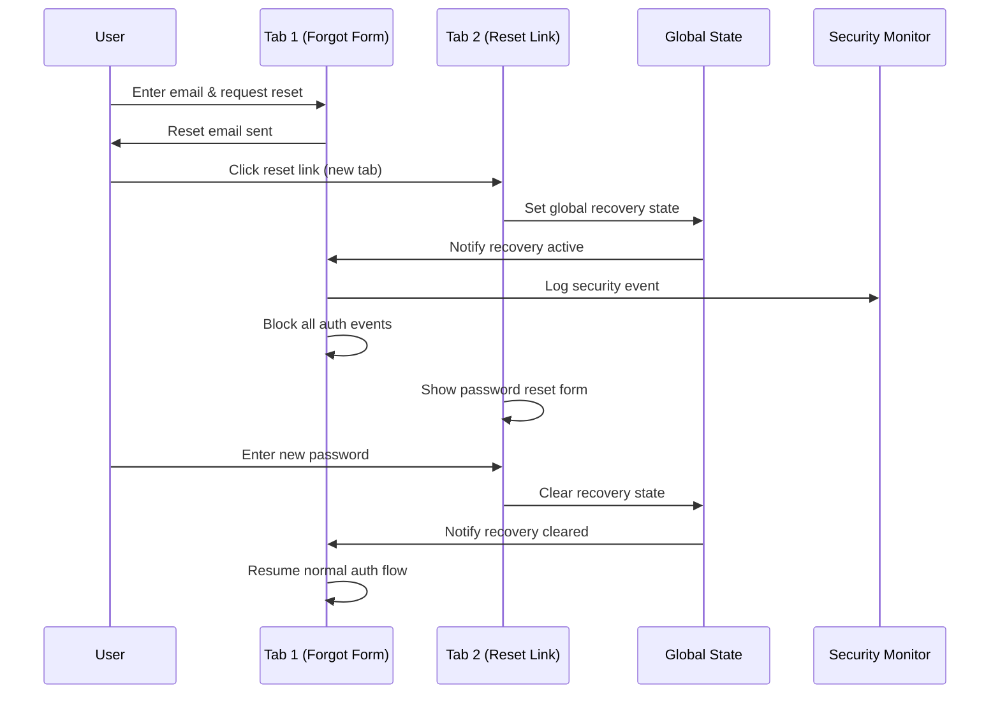

# 🔐 Password Recovery Security Implementation Guide

## Table of Contents
1. [Overview](#overview)
2. [The Problem We Solved](#the-problem-we-solved)
3. [Security Architecture](#security-architecture)
4. [Password Recovery Flow](#password-recovery-flow)
5. [Cross-Tab Security System](#cross-tab-security-system)
6. [Security Measures](#security-measures)
7. [Implementation Details](#implementation-details)
8. [Testing & Validation](#testing--validation)
9. [Troubleshooting](#troubleshooting)

---

## Overview

AudioBook Creator implements a **comprehensive password recovery security system** that prevents session hijacking, cross-tab authentication exploits, and various other attack vectors. This system ensures users can safely reset their passwords without compromising application security.

### Key Features
- ✅ **Cross-tab security synchronization**
- ✅ **Global password recovery state management**
- ✅ **Session hijacking prevention**
- ✅ **Real-time security monitoring**
- ✅ **Automatic token cleanup**
- ✅ **Attack pattern detection**

---

## The Problem We Solved

### Original Security Vulnerability

**Scenario**: User requests password reset → Email link opens in new tab → **Original tab automatically logs in**

**Root Cause**: Supabase shares authentication events across browser tabs. When a user clicks a password reset link:

1. **Tab 1**: `/auth?mode=forgot` (forgot password form) - Normal mode
2. **Tab 2**: Reset link opens `/auth/reset-password` - Recovery mode  
3. **Supabase**: Creates session and fires `SIGNED_IN` event
4. **Tab 1**: Receives `SIGNED_IN` event → Auto-login (SECURITY BREACH)

### Additional Vulnerabilities Addressed

1. **Session Hijacking**: Malicious scripts exploiting authentication events
2. **Concurrent Authentication**: Multiple login attempts causing state confusion
3. **OAuth Interference**: Fake OAuth callbacks during password recovery
4. **Token Manipulation**: LocalStorage token tampering
5. **Brute Force Attacks**: Rapid authentication attempts

---

## Security Architecture

### Core Components

```
┌─────────────────────┐    ┌─────────────────────┐    ┌─────────────────────┐
│  Global Recovery    │◄──►│   Session Manager   │◄──►│   Security Monitor  │
│      State          │    │                     │    │                     │
└─────────────────────┘    └─────────────────────┘    └─────────────────────┘
         │                           │                           │
         ▼                           ▼                           ▼
┌─────────────────────┐    ┌─────────────────────┐    ┌─────────────────────┐
│   Cross-Tab Sync    │    │   Auth Module       │    │   Event Logger      │
│   (localStorage)    │    │                     │    │                     │
└─────────────────────┘    └─────────────────────┘    └─────────────────────┘
```

### Security Layers

1. **Layer 1**: Global recovery state detection
2. **Layer 2**: Cross-tab communication and synchronization  
3. **Layer 3**: Authentication event filtering
4. **Layer 4**: Session validation and security checks
5. **Layer 5**: Real-time monitoring and attack detection

---

## Password Recovery Flow

### Step-by-Step Process

#### 1. Password Reset Request
```javascript
// User clicks "Forgot Password" and enters email
await authModule.resetPassword(email);
// ✅ Email sent with recovery link
```

#### 2. Global Recovery State Activation
```javascript
// When reset link is clicked (new tab)
if (urlHash.includes('type=recovery') || currentPath === '/auth/reset-password') {
    sessionManager.activatePasswordRecovery();
    // ✅ Global recovery state set for ALL tabs
}
```

#### 3. Cross-Tab Security Synchronization
```javascript
// Original tab detects global recovery state
handleRecoveryStorageChange(event) {
    if (recoveryState && !this.isRecoveryStateExpired(recoveryState)) {
        this.activatePasswordRecovery(false); // Don't update storage again
        // ✅ All tabs now in recovery mode
    }
}
```

#### 4. Authentication Event Filtering
```javascript
// ALL authentication events blocked during recovery
if (sessionManager.isPasswordRecovery) {
    switch (event) {
        case 'SIGNED_IN':
        case 'INITIAL_SESSION':
            console.log(`🔑 Ignoring ${event} during password recovery mode.`);
            return; // ✅ Auto-login prevented
    }
}
```

#### 5. Password Update & Cleanup
```javascript
// After successful password update
await supabaseClient.auth.updateUser({ password: newPassword });
await this.signOut(); // Sign out completely
sessionManager.clearPasswordRecoveryFlag(); // Clear global state
// ✅ Security state reset across all tabs
```

### Visual Flow Diagram



---

## Cross-Tab Security System

### Global State Management

#### Recovery State Structure
```javascript
const recoveryState = {
    active: true,
    timestamp: Date.now(),
    tabId: "tab_1640995200000_abc123def",
    path: "/auth/reset-password"
};
```

#### Storage Key
```javascript
const RECOVERY_STORAGE_KEY = 'supabase_password_recovery_active';
const RECOVERY_TIMEOUT = 30 * 60 * 1000; // 30 minutes
```

### Cross-Tab Communication

#### Setting Global Recovery State
```javascript
setGlobalRecoveryState() {
    const recoveryState = {
        active: true,
        timestamp: Date.now(),
        tabId: this.generateTabId(),
        path: window.location.pathname
    };
    localStorage.setItem(this.RECOVERY_STORAGE_KEY, JSON.stringify(recoveryState));
}
```

#### Listening for Cross-Tab Changes
```javascript
window.addEventListener('storage', (event) => {
    if (event.key === RECOVERY_STORAGE_KEY) {
        const recoveryState = event.newValue ? JSON.parse(event.newValue) : null;
        if (recoveryState && !this.isRecoveryStateExpired(recoveryState)) {
            this.activatePasswordRecovery(false); // Sync with other tabs
        }
    }
});
```

### Automatic State Cleanup

#### Expiration Check
```javascript
isRecoveryStateExpired(recoveryState) {
    if (!recoveryState || !recoveryState.timestamp) return true;
    return (Date.now() - recoveryState.timestamp) > this.RECOVERY_TIMEOUT;
}
```

#### Cleanup on Success
```javascript
clearPasswordRecoveryFlag(updateStorage = true) {
    this.isPasswordRecovery = false;
    if (updateStorage) {
        localStorage.removeItem(this.RECOVERY_STORAGE_KEY);
        // ✅ All tabs notified via storage event
    }
}
```

---

## Security Measures

### 1. Session Hijacking Prevention

#### JWT Validation
```javascript
validateSessionSecurity(session, authEvent) {
    // Validate JWT token structure
    if (session.access_token && !this.isValidJWT(session.access_token)) {
        console.warn('🚨 Invalid JWT structure detected');
        return false;
    }
    
    // Block SIGNED_IN during recovery
    if (sessionManager.isPasswordRecovery && authEvent === 'SIGNED_IN') {
        console.warn('🚨 Blocked SIGNED_IN during password recovery');
        return false;
    }
    
    return true;
}
```

#### Token Cleanup
```javascript
activatePasswordRecovery() {
    // Clear any existing auth tokens
    const existingToken = localStorage.getItem('auth_token');
    if (existingToken) {
        localStorage.removeItem('auth_token');
        console.log('🔑 Cleared existing auth token for password recovery');
    }
}
```

### 2. Rapid Authentication Protection

```javascript
validateSessionSecurity(session, authEvent) {
    // Check for rapid successive authentication attempts
    const now = Date.now();
    const timeSinceLastAuth = now - (this.lastAuthTime || 0);
    if (timeSinceLastAuth < 1000) { // Less than 1 second
        sessionManager.logSecurityEvent('rapid_auth_attempt', {
            timeSinceLastAuth,
            authEvent,
            userId: session.user?.id
        });
        return false;
    }
    this.lastAuthTime = now;
}
```

### 3. OAuth Security Validation

```javascript
validateSessionSecurity(session, authEvent) {
    // Check for suspicious OAuth callbacks
    if (authEvent === 'SIGNED_IN' && window.location.search.includes('from=google')) {
        const hasOAuthParams = window.location.search.includes('code=') || 
                             window.location.hash.includes('access_token=');
        if (!hasOAuthParams) {
            console.warn('🚨 Suspicious OAuth callback without parameters');
            return false;
        }
    }
}
```

### 4. Email Format Validation

```javascript
isValidEmail(email) {
    const emailRegex = /^[^\s@]+@[^\s@]+\.[^\s@]+$/;
    return emailRegex.test(email);
}

// Used in validation
if (session.user?.email && !this.isValidEmail(session.user.email)) {
    console.warn('🚨 Invalid email format in session');
    return false;
}
```

---

## Implementation Details

### File Structure
```
frontend/js/modules/
├── auth.js                 # Main authentication module
├── sessionManager.js       # Cross-tab security & state management
├── recaptcha.js           # reCAPTCHA security integration
└── router.js              # Route protection

frontend/pages/auth/
├── auth.html              # Login/signup/forgot forms
├── auth.js                # Auth page logic
├── reset-password.html    # Password reset form
└── main.js                # Auth page entry point
```

### Key Classes & Methods

#### SessionManager Class
```javascript
class SessionManager {
    // Global recovery state management
    activatePasswordRecovery(updateStorage = true)
    clearPasswordRecoveryFlag(updateStorage = true)
    setGlobalRecoveryState()
    getGlobalRecoveryState()
    isRecoveryStateExpired(recoveryState)
    
    // Cross-tab communication
    handleRecoveryStorageChange(event)
    
    // Security monitoring
    logSecurityEvent(eventType, details)
    analyzeSecurityPatterns(events)
}
```

#### AuthModule Class
```javascript
class AuthModule {
    // Security validation
    validateSessionSecurity(session, authEvent)
    isValidEmail(email)
    
    // Password recovery handling
    handlePasswordRecoveryPage()
    setupPasswordResetForm()
    resetPassword(email)
}
```

### Configuration Constants

```javascript
// Security timeouts
const RECOVERY_TIMEOUT = 30 * 60 * 1000; // 30 minutes
const MIN_AUTH_CHECK_INTERVAL = 5000; // 5 seconds
const MIN_EVENT_INTERVAL = 500; // Duplicate event prevention

// Storage keys
const RECOVERY_STORAGE_KEY = 'supabase_password_recovery_active';
const AUTH_TOKEN_KEY = 'auth_token';
const SECURITY_EVENTS_KEY = 'security_events';

// Security thresholds
const RAPID_AUTH_THRESHOLD = 1000; // 1 second
const MAX_SECURITY_EVENTS = 10; // Keep last 10 events
const BRUTE_FORCE_THRESHOLD = 3; // 3 attempts in 5 minutes
```

---

## Testing & Validation

### Manual Testing Scenarios

#### 1. Cross-Tab Security Test
```bash
# Test Steps:
1. Open Tab 1: http://localhost:3000/auth?mode=forgot
2. Enter email and request password reset
3. Click reset link from email (opens Tab 2)
4. Verify Tab 1 shows: "Password recovery activated from another tab"
5. Verify Tab 1 blocks all authentication attempts
6. Complete password reset in Tab 2
7. Verify both tabs return to normal state
```

#### 2. Security Event Monitoring Test
```bash
# Test Steps:
1. Open browser console
2. Attempt rapid login attempts (< 1 second apart)
3. Check console for: "🚨 Security Event: rapid_auth_attempt"
4. Try suspicious OAuth callback without parameters
5. Verify security warnings are logged
```

#### 3. Recovery State Expiration Test
```bash
# Test Steps:
1. Manually set expired recovery state in localStorage:
   localStorage.setItem('supabase_password_recovery_active', 
     JSON.stringify({active: true, timestamp: Date.now() - 40*60*1000}))
2. Refresh page
3. Verify recovery state is automatically cleared
```

### Expected Log Outputs

#### Successful Cross-Tab Security
```
🔑 Password recovery mode detected during initialization
🔑 Global password recovery state activated
🔑 Password recovery activated from another tab
🔑 Ignoring SIGNED_IN during password recovery mode
Session state updated. Auth: false, Recovery: true
```

#### Security Event Detection
```
🚨 Security Event: {
  type: "rapid_auth_attempt",
  timestamp: 1640995200000,
  tabId: "tab_1640995200000_abc123def",
  details: { timeSinceLastAuth: 500, authEvent: "SIGNED_IN" }
}
```

#### Recovery Completion
```
✅ Password updated successfully
🔑 Auth token removed (password recovery mode)
🔑 Global password recovery state cleared
```

---

## Troubleshooting

### Common Issues & Solutions

#### Issue 1: Cross-Tab Communication Not Working
```javascript
// Check localStorage access
console.log('localStorage available:', typeof Storage !== 'undefined');

// Check recovery state
console.log('Recovery state:', 
  localStorage.getItem('supabase_password_recovery_active'));

// Verify event listeners
console.log('Storage listeners:', 
  window.getEventListeners(window).storage?.length || 0);
```

#### Issue 2: Recovery State Stuck
```javascript
// Manually clear recovery state
localStorage.removeItem('supabase_password_recovery_active');
sessionManager.clearPasswordRecoveryFlag();

// Check for expired states
const state = sessionManager.getGlobalRecoveryState();
console.log('Is expired:', sessionManager.isRecoveryStateExpired(state));
```

#### Issue 3: Security Events Not Logging
```javascript
// Check security event storage
console.log('Security events:', 
  JSON.parse(localStorage.getItem('security_events') || '[]'));

// Manually trigger security event
sessionManager.logSecurityEvent('test_event', { test: true });
```

### Debug Commands

```javascript
// Check current auth state
console.log('Auth state:', {
    isAuthenticated: sessionManager.isAuthenticated,
    isPasswordRecovery: sessionManager.isPasswordRecovery,
    user: sessionManager.user
});

// Check global recovery state
console.log('Global recovery:', sessionManager.getGlobalRecoveryState());

// View recent security events
console.log('Security events:', sessionManager.getRecentSecurityEvents());

// Force clear all security state
localStorage.removeItem('supabase_password_recovery_active');
localStorage.removeItem('security_events');
sessionManager.clearPasswordRecoveryFlag();
```

---

## Security Best Practices

### For Developers

1. **Never bypass recovery mode checks** - Always respect `sessionManager.isPasswordRecovery`
2. **Use security validation** - Call `validateSessionSecurity()` before processing auth
3. **Monitor security events** - Regularly check security event logs
4. **Test cross-tab scenarios** - Always test with multiple tabs open
5. **Validate user input** - Use `isValidEmail()` and other validators

### For Operations

1. **Monitor security logs** - Set up alerts for repeated security events
2. **Regular token cleanup** - Ensure old tokens are properly cleaned up
3. **Recovery timeout tuning** - Adjust `RECOVERY_TIMEOUT` based on usage patterns
4. **Audit authentication flows** - Regularly review auth event patterns

---

## Summary

The AudioBook Creator password recovery system provides comprehensive security through:

🔒 **Multi-layered security architecture**  
🔒 **Cross-tab synchronization and communication**  
🔒 **Real-time attack detection and prevention**  
🔒 **Automatic state cleanup and expiration**  
🔒 **Comprehensive logging and monitoring**  

This implementation ensures users can safely reset passwords without compromising application security, while providing developers with robust tools for security monitoring and threat detection. 