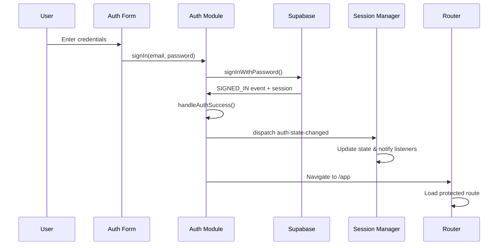
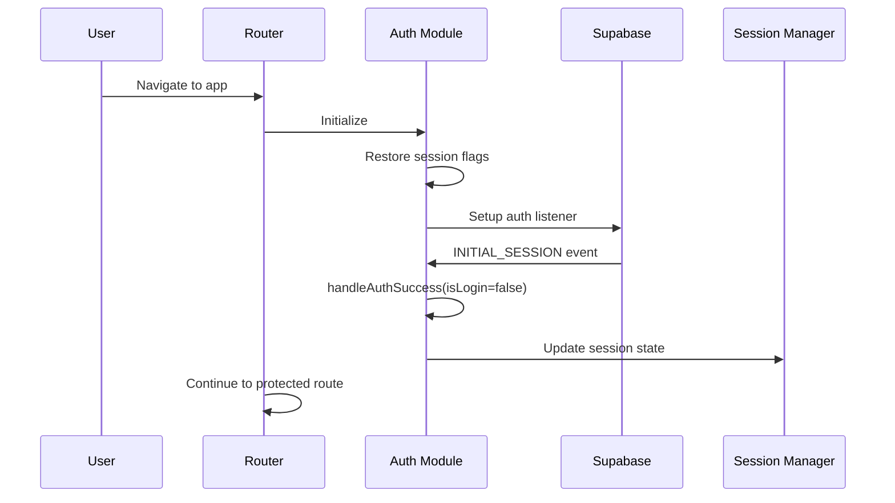
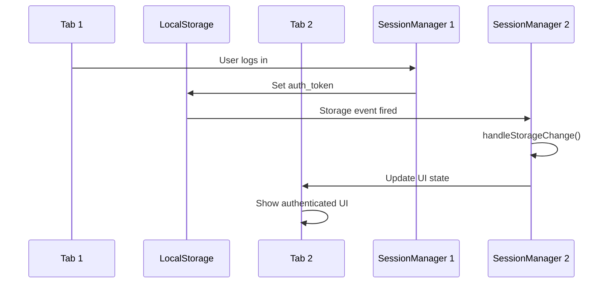

# 🔐 Session Management & Authentication Implementation Guide

## Table of Contents
1. [Overview](#overview)
2. [Architecture Overview](#architecture-overview)
3. [Supabase Authentication Integration](#supabase-authentication-integration)
4. [Session Manager Implementation](#session-manager-implementation)
5. [Authentication Module](#authentication-module)
6. [Router Integration](#router-integration)
7. [Authentication Flow Patterns](#authentication-flow-patterns)
8. [State Management](#state-management)
9. [Security Implementation](#security-implementation)
10. [API Integration](#api-integration)
11. [Troubleshooting](#troubleshooting)

---

## Overview

AudioBook Creator uses a sophisticated **dual-layer authentication system** combining **Supabase Auth** with a custom **Session Manager** for enhanced security, state management, and cross-tab synchronization. This architecture provides seamless user experience while maintaining enterprise-level security.

### Key Components
- 🔐 **Supabase Authentication**: JWT-based auth with OAuth support
- 🔄 **Custom Session Manager**: Cross-tab state synchronization  
- 🛡️ **Security Layer**: Attack prevention and monitoring
- 🌐 **Router Integration**: Route protection and navigation
- 🔑 **Token Management**: Secure storage and validation

---

## Architecture Overview

### High-Level Architecture

```
┌─────────────────┐    ┌─────────────────┐    ┌─────────────────┐
│   Application   │◄──►│     Router      │◄──►│  Route Guards   │
│      Pages      │    │                 │    │                 │
└─────────────────┘    └─────────────────┘    └─────────────────┘
         │                       │                       │
         ▼                       ▼                       ▼
┌─────────────────┐    ┌─────────────────┐    ┌─────────────────┐
│   Auth Module   │◄──►│ Session Manager │◄──►│ Security Monitor │
│   (Singleton)   │    │   (Singleton)   │    │                 │
└─────────────────┘    └─────────────────┘    └─────────────────┘
         │                       │                       │
         ▼                       ▼                       ▼
┌─────────────────┐    ┌─────────────────┐    ┌─────────────────┐
│ Supabase Client │    │   LocalStorage  │    │   Event System  │
│                 │    │                 │    │                 │
└─────────────────┘    └─────────────────┘    └─────────────────┘
```

### Component Responsibilities

| Component | Responsibility |
|-----------|----------------|
| **Supabase Client** | JWT authentication, OAuth, session management |
| **Auth Module** | Authentication logic, user management, API calls |
| **Session Manager** | Cross-tab state sync, security monitoring |
| **Router** | Route protection, navigation, auth guards |
| **Security Monitor** | Attack detection, event logging, validation |

---

## Supabase Authentication Integration

### Configuration

#### Supabase Client Setup
```javascript
// frontend/js/modules/auth.js
const supabaseClient = createClient(
    authConfig.supabase_url,
    authConfig.supabase_anon_key,
    {
        auth: {
            autoRefreshToken: true,     // Automatic token refresh
            persistSession: true,       // Persist across browser sessions
            detectSessionInUrl: true    // Handle OAuth callbacks
        }
    }
);
```

#### Authentication Configuration
```javascript
// Backend configuration loaded via API
const authConfig = {
    supabase_url: "https://project.supabase.co",
    supabase_anon_key: "anon_key_here",
    jwt_secret: "jwt_secret_here"
};
```

### Supabase Auth Events

Supabase fires authentication events that our system listens to:

```javascript
supabaseClient.auth.onAuthStateChange((event, session) => {
    switch (event) {
        case 'SIGNED_IN':           // User successfully authenticated
        case 'SIGNED_OUT':          // User logged out
        case 'TOKEN_REFRESHED':     // JWT token was refreshed
        case 'USER_UPDATED':        // User profile updated
        case 'PASSWORD_RECOVERY':   // Password reset initiated
        case 'INITIAL_SESSION':     // Page load with existing session
    }
});
```

### Supabase Session Structure

```javascript
// Session object from Supabase
const session = {
    access_token: "eyJhbGciOiJIUzI1NiIsInR5cCI6IkpXVCJ9...",
    refresh_token: "refresh_token_here",
    expires_in: 3600,
    expires_at: 1640995200,
    token_type: "bearer",
    user: {
        id: "user_uuid",
        email: "user@example.com",
        user_metadata: { full_name: "John Doe" },
        app_metadata: { role: "authenticated" }
    }
};
```

---

## Session Manager Implementation

### Core Functionality

The Session Manager acts as the **central hub** for authentication state across all browser tabs and handles security concerns.

#### Class Structure
```javascript
// frontend/js/modules/sessionManager.js
class SessionManager {
    constructor() {
        // Core authentication state
        this.user = null;
        this.isAuthenticated = false;
        this.isInitialized = false;
        
        // Security features
        this.isPasswordRecovery = false;
        this.hasBeenAuthenticated = false;
        
        // Cross-tab communication
        this.RECOVERY_STORAGE_KEY = 'supabase_password_recovery_active';
        this.RECOVERY_TIMEOUT = 30 * 60 * 1000; // 30 minutes
        
        // Event handling
        this.listeners = new Set();
        this.lastEventProcessed = null;
        this.lastEventTime = 0;
    }
}
```

### Cross-Tab State Synchronization

#### Singleton Pattern
```javascript
// Ensure only one SessionManager instance exists
class SessionManager {
    constructor() {
        if (SessionManager.instance) {
            return SessionManager.instance;
        }
        SessionManager.instance = this;
    }
}

// Global instance
const sessionManager = new SessionManager();
export default sessionManager;
```

#### Storage Event Listeners
```javascript
setupEventListeners() {
    // Listen for auth state changes from AuthModule
    window.addEventListener('auth-state-changed', event => {
        const { isAuthenticated, user, session } = event.detail;
        this.handleAuthStateChange(isAuthenticated, user, session);
    });

    // Listen for localStorage changes from other tabs
    window.addEventListener('storage', event => {
        if (event.key === 'auth_token' && !event.newValue && event.oldValue) {
            this.handleSignOut(); // Sign out if token removed in other tab
        }
    });
}
```

### State Management Methods

#### Authentication State Handling
```javascript
handleAuthStateChange(isAuthenticated, user, session) {
    // Prevent duplicate events
    const now = Date.now();
    const eventKey = `${isAuthenticated}_${user?.id}`;
    
    if (this.lastEventProcessed === eventKey && (now - this.lastEventTime) < 1000) {
        return; // Ignore duplicates within 1 second
    }
    
    // Update state
    this.isAuthenticated = isAuthenticated;
    this.user = user;
    
    // Handle token storage
    if (isAuthenticated && session?.token) {
        localStorage.setItem('auth_token', session.token);
    } else if (!isAuthenticated) {
        localStorage.removeItem('auth_token');
    }
    
    // Notify all listeners
    this.notifyStateChange();
}
```

#### Cross-Tab Notification System
```javascript
notifyStateChange() {
    const authState = {
        isAuthenticated: this.isAuthenticated,
        user: this.user,
        isPasswordRecovery: this.isPasswordRecovery
    };
    
    // Notify all registered listeners
    this.listeners.forEach(callback => {
        try {
            callback(authState);
        } catch (error) {
            console.error('Error in auth state listener:', error);
        }
    });
}
```

---

## Authentication Module

### Singleton AuthModule

The AuthModule is a singleton that handles all authentication operations and communicates with Supabase.

#### Core Structure
```javascript
// frontend/js/modules/auth.js
class AuthModule {
    constructor() {
        if (AuthModule.instance) {
            return AuthModule.instance;
        }
        
        // Session tracking
        this.user = null;
        this.session = null;
        this.sessionId = null;
        
        // UI state flags (persistent across page navigation)
        this.welcomeShownThisSession = false;
        this.userInitialized = false;
        this.newUserCreditsShown = false;
        
        AuthModule.instance = this;
    }
}
```

### Authentication Methods

#### Sign In Implementation
```javascript
async signIn(email, password, recaptchaToken = null) {
    try {
        // Backend validation with reCAPTCHA
        const response = await fetch('/api/auth/login', {
            method: 'POST',
            headers: { 'Content-Type': 'application/json' },
            body: JSON.stringify({
                email: email,
                password: password,
                recaptcha_token: recaptchaToken
            })
        });

        const result = await response.json();
        if (!result.success) {
            throw new Error(result.message || 'Login failed');
        }

        // Supabase authentication
        const { data, error } = await supabaseClient.auth.signInWithPassword({
            email: email,
            password: password
        });

        if (error) throw new Error(error.message);
        
        return { success: true, data };
    } catch (error) {
        showError(error.message || 'Sign in failed');
        return { success: false, error: error.message };
    }
}
```

#### OAuth Integration
```javascript
async signInWithGoogle() {
    try {
        const { data, error } = await supabaseClient.auth.signInWithOAuth({
            provider: 'google',
            options: {
                redirectTo: `${window.location.origin}/auth?from=google`,
                queryParams: {
                    access_type: 'offline',
                    prompt: 'consent',
                }
            }
        });

        if (error) throw new Error(error.message);
        return { success: true };
    } catch (error) {
        showError(error.message || 'Google sign in failed');
        return { success: false, error: error.message };
    }
}
```

### Session Persistence

#### Session Flags Management
```javascript
// Save flags that persist across page navigation
saveSessionFlags() {
    const sessionData = {
        sessionId: this.sessionId,
        welcomeShownThisSession: this.welcomeShownThisSession,
        userInitialized: this.userInitialized,
        newUserCreditsShown: this.newUserCreditsShown,
        timestamp: Date.now()
    };
    localStorage.setItem('auth_session_data', JSON.stringify(sessionData));
}

// Restore flags on page load
restoreSessionFlags() {
    const sessionData = localStorage.getItem('auth_session_data');
    if (sessionData) {
        const data = JSON.parse(sessionData);
        // Only restore if within 24 hours
        if (Date.now() - data.timestamp < 24 * 60 * 60 * 1000) {
            this.welcomeShownThisSession = data.welcomeShownThisSession || false;
            this.userInitialized = data.userInitialized || false;
            this.newUserCreditsShown = data.newUserCreditsShown || false;
        }
    }
}
```

### Auth State Event Handling

#### Centralized Event Processing
```javascript
setupAuthListener() {
    supabaseClient.auth.onAuthStateChange(async (event, session) => {
        // Prevent duplicate events
        const now = Date.now();
        if (event === lastEvent && (now - lastEventTime) < 500) {
            return;
        }
        
        console.log('🔄 Auth state changed:', event);
        
        // Handle each event type
        switch (event) {
            case 'SIGNED_IN':
                await this.handleAuthSuccess(session, true, event);
                break;
                
            case 'INITIAL_SESSION':
                if (session) {
                    await this.handleAuthSuccess(session, false, event);
                } else {
                    await this.handleSignOut();
                }
                break;
                
            case 'SIGNED_OUT':
                await this.handleSignOut();
                break;
                
            case 'TOKEN_REFRESHED':
                await this.handleTokenRefresh(session);
                break;
                
            case 'PASSWORD_RECOVERY':
                sessionManager.activatePasswordRecovery();
                break;
        }
    });
}
```

---

## Router Integration

### Route Protection

The router integrates with the authentication system to protect routes and handle navigation.

#### Route Configuration
```javascript
// frontend/js/modules/router.js
const routeConfig = {
    '/': { 
        component: 'landing', 
        requiresAuth: false,
        title: 'AudioBook Creator'
    },
    '/auth': { 
        component: 'auth', 
        requiresAuth: false,
        title: 'Sign In'
    },
    '/app': { 
        component: 'app', 
        requiresAuth: true,
        title: 'Dashboard'
    },
    '/auth/reset-password': { 
        component: 'reset-password', 
        requiresAuth: false,
        title: 'Reset Password'
    }
};
```

#### Authentication Guards
```javascript
async handleRoute(path = null, state = {}) {
    const route = routeConfig[targetPath];
    const isAuthenticated = sessionManager.isAuthenticated;
    const isPasswordRecovery = sessionManager.isPasswordRecovery;
    
    // Check authentication requirements
    if (route.requiresAuth && !isAuthenticated) {
        console.warn(`🔒 Route ${targetPath} requires authentication`);
        showInfo('Please sign in to access this page');
        await this.navigate('/auth');
        return;
    }
    
    // Redirect authenticated users away from auth page
    if (targetPath === '/auth' && isAuthenticated && !isPasswordRecovery) {
        console.log('👤 User already authenticated, redirecting to app');
        await this.navigate('/app');
        return;
    }
    
    // Load the route
    await this.loadRoute(route);
}
```

#### Navigation with State
```javascript
async navigate(path, options = {}) {
    const state = {
        isAuthenticated: sessionManager.isAuthenticated,
        isPasswordRecovery: sessionManager.isPasswordRecovery,
        ...options
    };
    
    // Update browser history
    if (options.pushState !== false) {
        history.pushState(state, '', path);
    }
    
    // Handle the route
    await this.handleRoute(path, state);
}
```

---

## Authentication Flow Patterns

### Login Flow



### Session Restoration Flow



### Cross-Tab Synchronization Flow



---

## State Management

### Authentication State Structure

```javascript
const authState = {
    // Core authentication
    isAuthenticated: boolean,
    user: {
        id: string,
        email: string,
        user_metadata: object,
        app_metadata: object
    },
    
    // Session tracking
    sessionId: string,
    lastAuthCheck: timestamp,
    
    // Security flags
    isPasswordRecovery: boolean,
    hasBeenAuthenticated: boolean,
    
    // UI state flags (persistent)
    welcomeShownThisSession: boolean,
    userInitialized: boolean,
    newUserCreditsShown: boolean
};
```

### State Synchronization

#### Local State Management
```javascript
class SessionManager {
    getAuthState() {
        return {
            isAuthenticated: this.isAuthenticated,
            user: this.user,
            isPasswordRecovery: this.isPasswordRecovery,
            hasBeenAuthenticated: this.hasBeenAuthenticated
        };
    }
    
    addListener(callback) {
        this.listeners.add(callback);
        // Immediately call with current state
        callback(this.getAuthState());
    }
    
    removeListener(callback) {
        this.listeners.delete(callback);
    }
}
```

#### Component Integration
```javascript
// Example: Auth page listening to state changes
function initAuthPage(authModule) {
    const handleAuthStateChange = (authState) => {
        if (authState.isAuthenticated) {
            // User is logged in, redirect
            window.router.navigate('/app');
        } else {
            // Show login form
            updateAuthUI(authState);
        }
    };
    
    // Add listener
    sessionManager.addListener(handleAuthStateChange);
    
    // Cleanup on page unload
    window.addEventListener('beforeunload', () => {
        sessionManager.removeListener(handleAuthStateChange);
    });
}
```

---

## Security Implementation

### JWT Token Validation

#### Token Structure Validation
```javascript
isValidJWT(token) {
    if (!token || typeof token !== 'string') return false;
    
    const parts = token.split('.');
    if (parts.length !== 3) {
        console.warn('Invalid JWT format - wrong number of segments');
        return false;
    }
    
    const base64Pattern = /^[A-Za-z0-9_-]+$/;
    return parts.every(part => base64Pattern.test(part));
}
```

#### Token Expiration Check
```javascript
async checkAuthStatus() {
    const authToken = localStorage.getItem('auth_token');
    if (!authToken || !this.isValidJWT(authToken)) {
        this.setUnauthenticated();
        return;
    }

    // Verify with backend
    try {
        const response = await fetch('/api/auth/status', {
            headers: { 
                'Authorization': `Bearer ${authToken}`,
                'Content-Type': 'application/json'
            }
        });
        
        if (response.ok) {
            const data = await response.json();
            if (data.authenticated && data.user) {
                this.user = data.user;
                this.isAuthenticated = true;
            } else {
                this.setUnauthenticated();
            }
        } else {
            this.setUnauthenticated();
        }
    } catch (error) {
        console.error('Auth check error:', error);
        this.setUnauthenticated();
    }
}
```

### Session Security

#### Secure Token Storage
```javascript
// Store tokens securely
if (session?.token && this.isValidJWT(session.token)) {
    localStorage.setItem('auth_token', session.token);
    console.log('✅ Valid auth token stored');
} else {
    console.warn('⚠️ Invalid JWT token received');
}
```

#### Automatic Cleanup
```javascript
// Clean up on sign out
setUnauthenticated() {
    localStorage.removeItem('auth_token');
    this.isAuthenticated = false;
    this.user = null;
}

// Listen for tab-level sign out
handleStorageChange(event) {
    if (event.key === 'auth_token' && !event.newValue && event.oldValue) {
        this.handleSignOut(); // Sync sign out across tabs
    }
}
```

---

## API Integration

### Authenticated API Calls

#### AuthModule API Request Method
```javascript
async apiRequest(endpoint, options = {}) {
    const authToken = localStorage.getItem('auth_token');
    
    if (!authToken) {
        throw new Error('Authentication required');
    }
    
    const defaultOptions = {
        headers: {
            'Authorization': `Bearer ${authToken}`,
            'Content-Type': 'application/json'
        }
    };
    
    const mergedOptions = {
        ...defaultOptions,
        ...options,
        headers: {
            ...defaultOptions.headers,
            ...options.headers
        }
    };
    
    try {
        const response = await fetch(endpoint, mergedOptions);
        
        // Handle authentication errors
        if (response.status === 401) {
            console.warn('🔒 API request unauthorized - token may be expired');
            await this.handleSignOut();
            throw new Error('Authentication required');
        }
        
        return response;
    } catch (error) {
        console.error('API request failed:', error);
        throw error;
    }
}
```

#### Usage Example
```javascript
// Example: Fetch user credits
async function getUserCredits() {
    try {
        const response = await window.authModule.apiRequest('/api/user/credits', {
            method: 'GET'
        });
        
        if (response.ok) {
            const data = await response.json();
            return data.credits;
        } else {
            throw new Error('Failed to fetch credits');
        }
    } catch (error) {
        console.error('Credits fetch failed:', error);
        throw error;
    }
}
```

### Backend Integration

#### Auth Status Endpoint
```python
# backend/routes/auth_routes.py
@auth_bp.route('/status', methods=['GET'])
def auth_status():
    try:
        # Get token from Authorization header
        auth_header = request.headers.get('Authorization')
        if not auth_header or not auth_header.startswith('Bearer '):
            return jsonify({'authenticated': False}), 401
        
        token = auth_header.split(' ')[1]
        
        # Verify token with Supabase
        supabase_service = get_supabase_service()
        payload = supabase_service.verify_jwt_token(token)
        
        if not payload:
            return jsonify({'authenticated': False}), 401
        
        return jsonify({
            'authenticated': True,
            'user': {
                'id': payload.get('sub'),
                'email': payload.get('email'),
                'role': payload.get('role', 'authenticated')
            }
        })
        
    except Exception as e:
        logger.error(f"Auth status error: {e}")
        return jsonify({'authenticated': False}), 500
```

---

## Troubleshooting

### Common Issues

#### Issue 1: User Not Authenticated After Page Reload
**Symptoms**: User appears signed out after refreshing page
**Cause**: Session restoration not working properly

```javascript
// Debug session restoration
console.log('Supabase session:', await supabaseClient.auth.getSession());
console.log('Local auth token:', localStorage.getItem('auth_token'));
console.log('Session manager state:', sessionManager.getAuthState());

// Force session check
await sessionManager.checkAuthStatus();
```

#### Issue 2: Cross-Tab State Not Syncing
**Symptoms**: Authentication state differs between tabs
**Cause**: Storage event listeners not working

```javascript
// Check localStorage support
console.log('localStorage available:', typeof Storage !== 'undefined');

// Check event listeners
console.log('Storage event listeners:', 
  window.getEventListeners(window).storage?.length || 0);

// Manually trigger storage event
localStorage.setItem('test_key', 'test_value');
localStorage.removeItem('test_key');
```

#### Issue 3: Token Validation Failures
**Symptoms**: API calls return 401 errors
**Cause**: Invalid or expired JWT tokens

```javascript
// Debug token validation
const token = localStorage.getItem('auth_token');
console.log('Token exists:', !!token);
console.log('Token valid format:', sessionManager.isValidJWT(token));

// Check token with backend
const response = await fetch('/api/auth/status', {
    headers: { 'Authorization': `Bearer ${token}` }
});
console.log('Backend validation:', await response.json());
```

### Debug Utilities

#### Authentication State Inspector
```javascript
function debugAuthState() {
    console.log('=== Authentication Debug Info ===');
    console.log('SessionManager:', {
        isAuthenticated: sessionManager.isAuthenticated,
        user: sessionManager.user,
        isPasswordRecovery: sessionManager.isPasswordRecovery
    });
    
    console.log('AuthModule:', {
        user: window.authModule?.user,
        session: window.authModule?.session,
        isAuthenticated: window.authModule?.isAuthenticated()
    });
    
    console.log('Storage:', {
        authToken: localStorage.getItem('auth_token'),
        sessionData: localStorage.getItem('auth_session_data')
    });
    
    console.log('Supabase:', supabaseClient.auth.getSession());
}

// Run in browser console
window.debugAuthState = debugAuthState;
```

#### Session Reset Utility
```javascript
function resetAuthState() {
    console.log('🔄 Resetting authentication state...');
    
    // Clear localStorage
    localStorage.removeItem('auth_token');
    localStorage.removeItem('auth_session_data');
    localStorage.removeItem('supabase_password_recovery_active');
    
    // Reset session manager
    sessionManager.isAuthenticated = false;
    sessionManager.user = null;
    sessionManager.isPasswordRecovery = false;
    
    // Sign out from Supabase
    supabaseClient.auth.signOut();
    
    console.log('✅ Auth state reset complete');
}

// Run in browser console
window.resetAuthState = resetAuthState;
```

---

## Summary

The AudioBook Creator authentication system provides:

### 🔐 **Secure Foundation**
- JWT-based authentication via Supabase
- Secure token storage and validation
- Cross-tab state synchronization

### 🔄 **Seamless Experience**
- Persistent sessions across page navigation
- Automatic token refresh
- Smart welcome message handling

### 🛡️ **Enterprise Security**
- Session hijacking prevention
- Attack pattern detection
- Cross-tab security coordination

### 🌐 **Scalable Architecture**
- Singleton pattern for consistency
- Event-driven state management
- Modular component design

This implementation ensures secure, scalable, and maintainable authentication while providing an excellent user experience across all application features. 