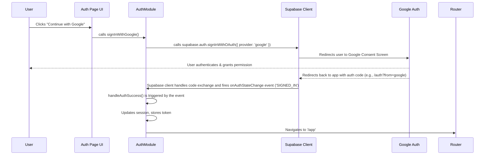

# 🔐 Google Authentication Flow

This document outlines the step-by-step process of how a user signs in using Google OAuth within the AudioBook Organizer application.

## Overview

The system uses Supabase Auth on the client-side to handle the complexities of the Google OAuth 2.0 flow. The frontend code initiates the sign-in, and Supabase redirects the user to Google and back. Our application listens for the authentication state changes to manage the user's session.

### Authentication Flow Diagram

## Step-by-Step Implementation

1.  **User Action**:
    *   The user clicks the "Continue with Google" button on `/auth`.
    *   This triggers the `handleGoogleAuth` function in `frontend/pages/auth/auth.js`.

2.  **Initiating OAuth**:
    *   `handleGoogleAuth` calls `authModule.signInWithGoogle()` from `frontend/js/modules/auth.js`.
    *   This function calls Supabase's built-in `signInWithOAuth` method, telling it to use the `google` provider.
    *   Crucially, we provide a `redirectTo` option (e.g., `https://yourapp.com/auth?from=google`). This tells Google where to send the user back after they approve the sign-in.

3.  **Google Authentication**:
    *   The user's browser is redirected away from our app to Google's standard authentication screen.
    *   The user signs into their Google account and grants our application the requested permissions.

4.  **Redirect and Session Creation**:
    *   Google redirects the user back to the URL we specified: `/auth?from=google`. The URL contains special tokens from Google.
    *   The Supabase client library, which is active on our page, automatically detects these tokens in the URL. It securely exchanges them with Google's servers in the background to get a valid session.

5.  **Handling the Session**:
    *   Once the Supabase client successfully creates a session, it fires an `onAuthStateChange` event with the type `SIGNED_IN`.
    *   Our central listener in `AuthModule` (`frontend/js/modules/auth.js`) catches this event.
    *   The `handleAuthSuccess` method is called, which stores the user's session and token, updates the `sessionManager`, and fires a global `auth-state-changed` event.

6.  **Final Navigation**:
    *   The `handleAuthSuccess` method sees that the authentication was successful and calls `router.navigate('/app')` to send the now-logged-in user to the main application. 