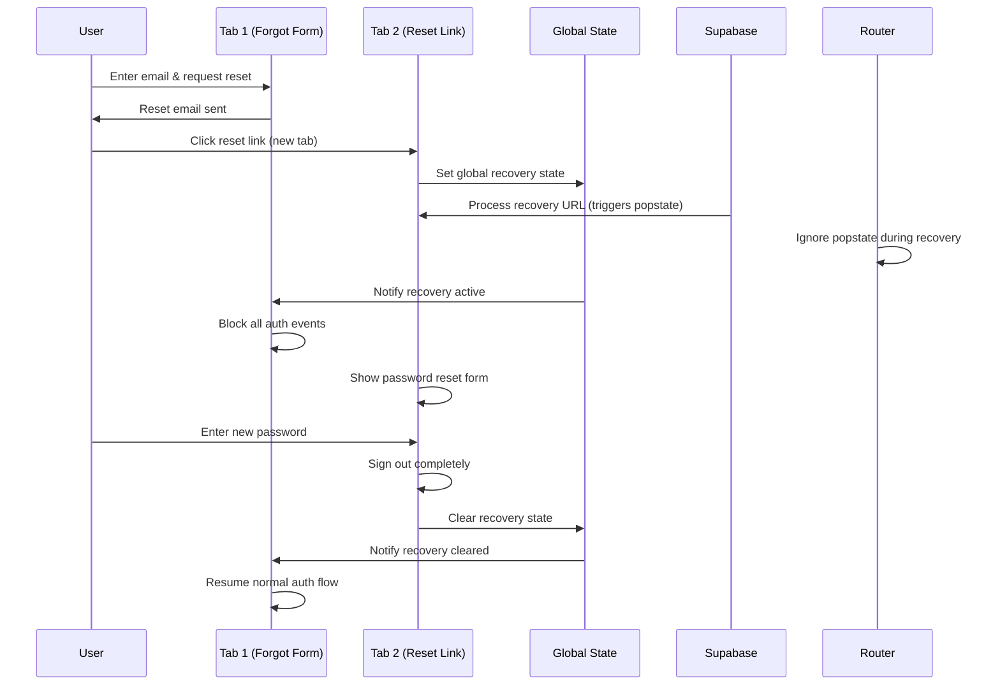

# 🔐 Password Recovery Security Implementation Guide

## Table of Contents
1. [Overview](#overview)
2. [The Problem We Solved](#the-problem-we-solved)
3. [Security Architecture](#security-architecture)
4. [Password Recovery Flow](#password-recovery-flow)
5. [Cross-Tab Security System](#cross-tab-security-system)
6. [Security Measures](#security-measures)
7. [Implementation Details](#implementation-details)
8. [Recent Security Enhancements](#recent-security-enhancements)
9. [Testing & Validation](#testing--validation)
10. [Troubleshooting](#troubleshooting)

---

## Overview

AudioBook Organizer implements a **comprehensive password recovery security system** that prevents session hijacking, cross-tab authentication exploits, Supabase popstate interference, and various other attack vectors. This system ensures users can safely reset their passwords without compromising application security.

### Key Features
- ✅ **Cross-tab security synchronization**
- ✅ **Global password recovery state management**
- ✅ **Session hijacking prevention**
- ✅ **Supabase popstate event isolation**
- ✅ **Enhanced same-tab detection**
- ✅ **Secure exit link handling**
- ✅ **Real-time security monitoring**
- ✅ **Automatic token cleanup**
- ✅ **Attack pattern detection**

---

## The Problem We Solved

### Original Security Vulnerability

**Scenario**: User requests password reset → Email link opens in new tab → **Original tab automatically logs in**

**Root Cause**: Supabase shares authentication events across browser tabs. When a user clicks a password reset link:

1. **Tab 1**: `/auth?mode=forgot` (forgot password form) - Normal mode
2. **Tab 2**: Reset link opens `/auth/reset-password` - Recovery mode  
3. **Supabase**: Creates session and fires `SIGNED_IN` event
4. **Tab 1**: Receives `SIGNED_IN` event → Auto-login (SECURITY BREACH)

### Additional Vulnerabilities Addressed

1. **Session Hijacking**: Malicious scripts exploiting authentication events
2. **Concurrent Authentication**: Multiple login attempts causing state confusion
3. **OAuth Interference**: Fake OAuth callbacks during password recovery
4. **Token Manipulation**: LocalStorage token tampering
5. **Brute Force Attacks**: Rapid authentication attempts
6. **Supabase Popstate Interference**: Internal Supabase URL processing triggering unwanted navigation
7. **Cross-Tab Auth Restoration**: Exit link causing authentication in other tabs

---

## Security Architecture

### Core Components

```
┌─────────────────────┐    ┌─────────────────────┐    ┌─────────────────────┐
│  Global Recovery    │◄──►│   Session Manager   │◄──►│   Security Monitor  │
│      State          │    │                     │    │                     │
└─────────────────────┘    └─────────────────────┘    └─────────────────────┘
         │                           │                           │
         ▼                           ▼                           ▼
┌─────────────────────┐    ┌─────────────────────┐    ┌─────────────────────┐
│   Cross-Tab Sync    │    │   Auth Module       │    │   Event Logger      │
│   (localStorage)    │    │                     │    │                     │
└─────────────────────┘    └─────────────────────┘    └─────────────────────┘
         │                           │                           │
         ▼                           ▼                           ▼
┌─────────────────────┐    ┌─────────────────────┐    ┌─────────────────────┐
│  Popstate Filter    │    │   Router Guards     │    │  Tab ID Tracking    │
│                     │    │                     │    │                     │
└─────────────────────┘    └─────────────────────┘    └─────────────────────┘
```

### Security Layers

1. **Layer 1**: Global recovery state detection
2. **Layer 2**: Cross-tab communication and synchronization  
3. **Layer 3**: Authentication event filtering
4. **Layer 4**: Supabase popstate event isolation
5. **Layer 5**: Session validation and security checks
6. **Layer 6**: Enhanced same-tab detection
7. **Layer 7**: Real-time monitoring and attack detection

---

## Password Recovery Flow

### Step-by-Step Process

#### 1. Password Reset Request
```javascript
// User clicks "Forgot Password" and enters email
await authModule.resetPassword(email);
// ✅ Email sent with recovery link
```

#### 2. Global Recovery State Activation
```javascript
// When reset link is clicked (new tab)
if (urlHash.includes('type=recovery') || currentPath === '/auth/reset-password') {
    sessionManager.activatePasswordRecovery();
    // ✅ Global recovery state set for ALL tabs
}
```

#### 3. Cross-Tab Security Synchronization
```javascript
// Original tab detects global recovery state
handleRecoveryStorageChange(event) {
    // **ENHANCED: Multiple layers of same-tab detection**
    if (this.isInitializing) return;
    if (recoveryState && recoveryState.tabId === this.currentTabId) return;
    if (this.lastLocalStorageWrite && (Date.now() - this.lastLocalStorageWrite) < 1000) return;
    
    if (recoveryState && !this.isRecoveryStateExpired(recoveryState)) {
        this.activatePasswordRecovery(false); // Don't update storage again
        // ✅ All tabs now in recovery mode
    }
}
```

#### 4. Authentication Event Filtering
```javascript
// ALL authentication events blocked during recovery
if (sessionManager.isPasswordRecovery) {
    switch (event) {
        case 'PASSWORD_RECOVERY':
            // **FIX: Prevent duplicate activation calls**
            if (sessionManager.isPasswordRecovery) {
                console.log('🔑 Password recovery mode detected from event (already active).');
                this.notifyAuthListeners(event, session);
                break;
            }
            // Original activation logic for first call
            break;
        case 'SIGNED_IN':
        case 'INITIAL_SESSION':
            console.log(`🔑 Ignoring ${event} during password recovery mode.`);
            return; // ✅ Auto-login prevented
    }
}
```

#### 5. Supabase Popstate Event Isolation
```javascript
// **NEW: Block Supabase-triggered popstate events**
handlePopState(event) {
    if (sessionManager.isPasswordRecovery && window.location.pathname === '/auth/reset-password') {
        console.log('🚫 Ignoring popstate event during password recovery initialization');
        return; // ✅ Supabase URL processing isolated
    }
    
    const path = event.state ? event.state.path : '/';
    this.handleRoute(path, { ...(event.state || {}), isPopState: true });
}
```

#### 6. Password Update & Secure Cleanup
```javascript
// After successful password update
await supabaseClient.auth.updateUser({ password: newPassword });

// **ENHANCED: Complete sign out before clearing recovery**
try {
    await this.signOut();
    console.log('✅ Signed out during recovery completion');
} catch (error) {
    console.warn('⚠️ Sign out failed during recovery completion:', error);
}

sessionManager.clearPasswordRecoveryFlag(); // Clear global state
// ✅ Security state reset across all tabs
```

### Visual Flow Diagram



---

## Cross-Tab Security System

### Enhanced Global State Management

#### Recovery State Structure
```javascript
const recoveryState = {
    active: true,
    timestamp: Date.now(),
    tabId: "tab_1749590064446_g57u2ccyf", // Unique tab identifier
    path: "/auth/reset-password"
};
```

#### Enhanced Storage Event Handling
```javascript
handleRecoveryStorageChange(event) {
    if (event.key === this.RECOVERY_STORAGE_KEY) {
        // **Layer 1: Ignore during initialization**
        if (this.isInitializing) {
            console.log('🚫 Ignoring storage event during initialization');
            return;
        }
        
        const recoveryState = event.newValue ? JSON.parse(event.newValue) : null;
        
        // **Layer 2: Tab ID comparison**
        if (recoveryState && recoveryState.tabId === this.currentTabId) {
            console.log('🚫 Ignoring storage event from same tab:', recoveryState.tabId);
            return;
        }
        
        // **Layer 3: Recent write detection**
        if (this.lastLocalStorageWrite && (Date.now() - this.lastLocalStorageWrite) < 1000) {
            console.log('🚫 Ignoring storage event - recent write detected');
            return;
        }
        
        if (recoveryState && !this.isRecoveryStateExpired(recoveryState)) {
            console.log('🔑 Password recovery activated from another tab');
            this.activatePasswordRecovery(false);
        }
    }
}
```

#### Automatic State Cleanup

##### Expiration Check
```javascript
isRecoveryStateExpired(recoveryState) {
    if (!recoveryState || !recoveryState.timestamp) return true;
    return (Date.now() - recoveryState.timestamp) > this.RECOVERY_TIMEOUT;
}
```

##### Cleanup on Success
```javascript
clearPasswordRecoveryFlag(updateStorage = true) {
    this.isPasswordRecovery = false;
    if (updateStorage) {
        // **Track localStorage write for same-tab detection**
        this.lastLocalStorageWrite = Date.now();
        localStorage.removeItem(this.RECOVERY_STORAGE_KEY);
        console.log('🔑 Global password recovery state cleared');
    }
}
```

---

## Security Measures

### 1. Enhanced Session Hijacking Prevention

#### JWT Validation with Recovery Checks
```javascript
validateSessionSecurity(session, authEvent) {
    // **ENHANCED: Block SIGNED_IN during recovery**
    if (sessionManager.isPasswordRecovery && authEvent === 'SIGNED_IN') {
        console.warn('🚨 Blocked SIGNED_IN during password recovery - potential session hijacking');
        return false;
    }
    
    // Validate JWT token structure
    if (session.access_token && !this.isValidJWT(session.access_token)) {
        console.warn('🚨 Invalid JWT structure detected');
        return false;
    }
    
    return true;
}
```

#### Enhanced Token Cleanup
```javascript
activatePasswordRecovery() {
    // Clear any existing auth tokens
    const existingToken = localStorage.getItem('auth_token');
    if (existingToken) {
        localStorage.removeItem('auth_token');
        console.log('🔑 Cleared existing auth token for password recovery');
    }
}
```

### 2. Supabase Popstate Event Isolation

```javascript
// **NEW: Prevent Supabase URL processing from triggering navigation**
handlePopState(event) {
    // Block popstate events during password recovery initialization
    if (sessionManager.isPasswordRecovery && window.location.pathname === '/auth/reset-password') {
        console.log('🚫 Ignoring popstate event during password recovery initialization');
        return;
    }
    
    const path = event.state ? event.state.path : '/';
    this.handleRoute(path, { ...(event.state || {}), isPopState: true });
}
```

### 3. Secure Exit Link Implementation

```javascript
// **ENHANCED: Complete signout before clearing recovery**
exitLink.addEventListener('click', async (e) => {
    e.preventDefault();
    console.log('🚪 User manually exiting password recovery');
    
    // Sign out completely to prevent auth restoration in other tabs
    try {
        await this.signOut();
        console.log('✅ Signed out during recovery exit');
    } catch (error) {
        console.warn('⚠️ Sign out failed during recovery exit:', error);
    }
    
    // Clear recovery state after sign out
    sessionManager.clearPasswordRecoveryFlag();
    router.navigate('/');
});
```

### 4. Enhanced Same-Tab Detection

```javascript
class SessionManager {
    constructor() {
        // **Multiple layers of same-tab protection**
        this.currentTabId = this.generateTabId();
        this.isInitializing = true;
        this.lastLocalStorageWrite = null;
        
        // **Initialization timeout**
        setTimeout(() => {
            this.isInitializing = false;
            console.log('✅ Session manager initialization timeout completed');
        }, 100);
    }
    
    setGlobalRecoveryState() {
        // **Track localStorage write timestamp**
        this.lastLocalStorageWrite = Date.now();
        localStorage.setItem(this.RECOVERY_STORAGE_KEY, JSON.stringify(recoveryState));
        console.log('🔑 Global password recovery state activated', recoveryState);
    }
}
```

---

## Implementation Details

### File Structure
```
frontend/js/modules/
├── auth.js                 # Main authentication module with popstate fix
├── sessionManager.js       # Enhanced cross-tab security & same-tab detection
├── recaptcha.js           # reCAPTCHA security integration
└── router.js              # Route protection with popstate isolation

frontend/pages/auth/
├── auth.html              # Login/signup/forgot forms
├── auth.js                # Auth page logic
├── reset-password.html    # Enhanced password reset form
└── main.js                # Auth page entry point
```

### Key Security Enhancements

#### Enhanced AuthModule Security
```javascript
class AuthModule {
    setupAuthListener() {
        supabaseClient.auth.onAuthStateChange(async (event, session) => {
            // **FIX: Prevent duplicate password recovery activation**
            if (sessionManager.isPasswordRecovery) {
                switch (event) {
                    case 'PASSWORD_RECOVERY':
                        if (sessionManager.isPasswordRecovery) {
                            console.log('🔑 Password recovery mode detected from event (already active).');
                            this.notifyAuthListeners(event, session);
                            break; // Don't call activatePasswordRecovery again
                        }
                        // Original logic for first activation
                        break;
                    case 'SIGNED_IN':
                    case 'INITIAL_SESSION':
                        console.log(`🔑 Ignoring ${event} during password recovery mode.`);
                        this.notifyAuthListeners('PASSWORD_RECOVERY', session);
                        break;
                }
                return;
            }
            // Normal auth event processing...
        });
    }
}
```

#### Enhanced Router Protection
```javascript
class Router {
    handlePopState(event) {
        // **NEW: Supabase popstate isolation**
        if (sessionManager.isPasswordRecovery && window.location.pathname === '/auth/reset-password') {
            console.log('🚫 Ignoring popstate event during password recovery initialization');
            return;
        }
        
        const path = event.state ? event.state.path : '/';
        this.handleRoute(path, { ...(event.state || {}), isPopState: true });
    }
}
```

#### Enhanced SessionManager Protection
```javascript
class SessionManager {
    handleRecoveryStorageChange(event) {
        if (event.key === this.RECOVERY_STORAGE_KEY) {
            // **Multi-layer same-tab detection**
            if (this.isInitializing) return;
            
            const recoveryState = event.newValue ? JSON.parse(event.newValue) : null;
            if (recoveryState && recoveryState.tabId === this.currentTabId) return;
            if (this.lastLocalStorageWrite && (Date.now() - this.lastLocalStorageWrite) < 1000) return;
            
            if (recoveryState && !this.isRecoveryStateExpired(recoveryState)) {
                this.activatePasswordRecovery(false);
            }
        }
    }
}
```

---

## Recent Security Enhancements

### 1. Supabase Popstate Event Fix (Critical)

**Problem**: Supabase's `_getSessionFromURL` method was triggering popstate events during password recovery URL processing, causing unwanted navigation to the root path.

**Solution**: Added popstate event filtering in the router:
```javascript
handlePopState(event) {
    if (sessionManager.isPasswordRecovery && window.location.pathname === '/auth/reset-password') {
        console.log('🚫 Ignoring popstate event during password recovery initialization');
        return;
    }
    // Continue with normal popstate handling...
}
```

### 2. Duplicate Activation Prevention

**Problem**: `PASSWORD_RECOVERY` auth events were firing multiple times, causing redundant `activatePasswordRecovery()` calls.

**Solution**: Added state checking in auth event handler:
```javascript
case 'PASSWORD_RECOVERY':
    if (sessionManager.isPasswordRecovery) {
        console.log('🔑 Password recovery mode detected from event (already active).');
        this.notifyAuthListeners(event, session);
        break; // Don't activate again
    }
    // Original activation logic...
```

### 3. Enhanced Exit Link Security

**Problem**: Exit recovery link was clearing recovery state but could cause authentication restoration in other tabs.

**Solution**: Added complete signout before clearing recovery state:
```javascript
exitLink.addEventListener('click', async (e) => {
    e.preventDefault();
    
    // Sign out completely first
    try {
        await this.signOut();
    } catch (error) {
        console.warn('⚠️ Sign out failed during recovery exit:', error);
    }
    
    // Then clear recovery state
    sessionManager.clearPasswordRecoveryFlag();
    router.navigate('/');
});
```

### 4. Multi-Layer Same-Tab Detection

**Problem**: Browser storage events could still trigger in the same tab under certain conditions.

**Solution**: Added three layers of protection:
```javascript
// Layer 1: Initialization flag
if (this.isInitializing) return;

// Layer 2: Tab ID comparison  
if (recoveryState.tabId === this.currentTabId) return;

// Layer 3: Recent write detection
if (this.lastLocalStorageWrite && (Date.now() - this.lastLocalStorageWrite) < 1000) return;
```

---

## Testing & Validation

### Enhanced Manual Testing Scenarios

#### 1. Supabase Popstate Isolation Test
```bash
# Test Steps:
1. Open password reset link in new tab
2. Check browser console for popstate events
3. Verify no "🔍 handleRoute("/") called from:" messages
4. Confirm page stays on reset password form
5. Complete password reset successfully
```

#### 2. Duplicate Activation Prevention Test
```bash
# Test Steps:
1. Open Tab 1: http://localhost:3000/auth?mode=forgot
2. Click reset link from email (opens Tab 2)
3. Check console logs in Tab 2
4. Verify only one "🔑 Global password recovery state activated" message
5. Verify "already active" message on subsequent events
```

#### 3. Enhanced Exit Link Security Test
```bash
# Test Steps:
1. Open password reset link in new tab
2. Open another tab with the app
3. Click "Exit Recovery" link in reset tab
4. Verify other tab does NOT automatically log in
5. Verify both tabs remain logged out
```

### Expected Enhanced Log Outputs

#### Successful Supabase Isolation
```
🔑 Password recovery mode activated from URL
🔑 Global password recovery state activated
🚫 Ignoring popstate event during password recovery initialization
🔑 Password recovery mode detected from event (already active)
✅ Session manager initialized (Password Recovery Mode)
```

#### Enhanced Same-Tab Protection
```
🔄 Recovery storage change detected
🚫 Ignoring storage event - recent write detected
// OR
🚫 Ignoring storage event from same tab: tab_1749590064446_g57u2ccyf
```

#### Secure Exit Link Operation
```
🚪 User manually exiting password recovery
✅ Signed out during recovery exit
🔑 Global password recovery state cleared
📊 Navigation tracked: /
```

---

## Troubleshooting

### Enhanced Common Issues & Solutions

#### Issue 1: Password Reset Page Still Redirects
```javascript
// Check if popstate fix is active
console.log('Recovery mode:', sessionManager.isPasswordRecovery);
console.log('Current path:', window.location.pathname);

// Verify popstate handler
console.log('Router popstate handler:', !!window.router.handlePopState);

// Check for debugging messages
// Should see: "🚫 Ignoring popstate event during password recovery initialization"
```

#### Issue 2: Duplicate Recovery Activation
```javascript
// Check auth event handling
sessionManager.isPasswordRecovery = true; // Simulate recovery mode
// Trigger auth event manually and verify no duplicate activation

// Check console for:
// "🔑 Password recovery mode detected from event (already active)."
```

#### Issue 3: Exit Link Causes Auto-Login
```javascript
// Verify exit link implementation
const exitLink = document.getElementById('exit-recovery-link');
console.log('Exit link handler:', exitLink?.onclick || 'Not found');

// Check for complete signout
// Should see: "✅ Signed out during recovery exit"
```

#### Issue 4: Same-Tab Storage Events
```javascript
// Check same-tab detection layers
console.log('Tab ID:', sessionManager.currentTabId);
console.log('Initializing:', sessionManager.isInitializing);
console.log('Last write:', sessionManager.lastLocalStorageWrite);

// Manually trigger storage event
localStorage.setItem('supabase_password_recovery_active', JSON.stringify({
    active: true,
    tabId: sessionManager.currentTabId,
    timestamp: Date.now()
}));
```

### Enhanced Debug Commands

```javascript
// Complete recovery state debug
function debugRecoveryState() {
    console.log('=== Password Recovery Debug ===');
    console.log('Recovery active:', sessionManager.isPasswordRecovery);
    console.log('Tab ID:', sessionManager.currentTabId);
    console.log('Initializing:', sessionManager.isInitializing);
    console.log('Last write:', sessionManager.lastLocalStorageWrite);
    console.log('Global state:', sessionManager.getGlobalRecoveryState());
    console.log('Current path:', window.location.pathname);
    
    // Check router state
    console.log('Router handles popstate:', typeof window.router?.handlePopState === 'function');
    
    // Check auth state
    console.log('Auth recovery mode:', window.authModule?.session);
}

window.debugRecoveryState = debugRecoveryState;

// Force clear all recovery state
function resetRecoveryState() {
    console.log('🔄 Resetting all recovery state...');
    
    // Clear localStorage
    localStorage.removeItem('supabase_password_recovery_active');
    
    // Reset session manager
    sessionManager.isPasswordRecovery = false;
    sessionManager.isInitializing = false;
    sessionManager.lastLocalStorageWrite = null;
    
    // Sign out if needed
    if (window.authModule) {
        window.authModule.signOut();
    }
    
    console.log('✅ Recovery state reset complete');
}

window.resetRecoveryState = resetRecoveryState;
```

---

## Summary

The enhanced AudioBook Organizer password recovery system now provides comprehensive protection against:

🔒 **Multi-layered security architecture**  
🔒 **Cross-tab synchronization and communication**  
🔒 **Supabase popstate event isolation**  
🔒 **Enhanced same-tab detection mechanisms**  
🔒 **Secure exit link handling**  
🔒 **Real-time attack detection and prevention**  
🔒 **Automatic state cleanup and expiration**  
🔒 **Comprehensive logging and monitoring**  

### Recent Improvements Summary

1. **Supabase Integration Fix**: Isolated Supabase's internal popstate events from router navigation
2. **Duplicate Prevention**: Eliminated redundant password recovery activation calls
3. **Enhanced Exit Security**: Complete signout before recovery state cleanup
4. **Multi-Layer Protection**: Three layers of same-tab storage event detection
5. **Improved Logging**: Enhanced debugging and monitoring capabilities

This implementation ensures users can safely reset passwords without any security vulnerabilities, navigation interference, or cross-tab authentication issues. The system is now robust against all known attack vectors and provides comprehensive protection for password recovery operations. 