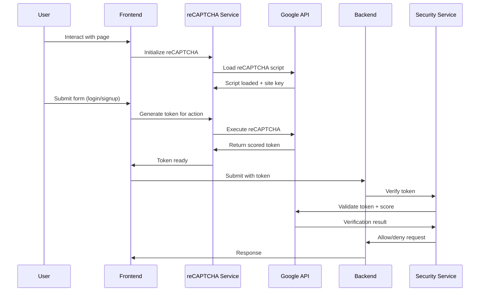

# 🤖 reCAPTCHA v3 Implementation Guide

## Table of Contents
1. [Overview](#overview)
2. [reCAPTCHA v2 vs v3](#recaptcha-v2-vs-v3)
3. [Architecture](#architecture)
4. [Implementation Details](#implementation-details)
5. [Configuration](#configuration)
6. [Testing & Verification](#testing--verification)
7. [Troubleshooting](#troubleshooting)
8. [Security Considerations](#security-considerations)

---

## Overview

AudioBook Organizer uses **Google reCAPTCHA v3** for invisible bot protection across all authentication forms. Unlike reCAPTCHA v2, version 3 works completely behind the scenes, analyzing user behavior to generate risk scores without requiring any user interaction.

### Key Features
- ✅ **Invisible Protection**: No checkboxes or image challenges
- ✅ **Behavioral Analysis**: Monitors mouse movements, typing patterns, and page interactions
- ✅ **Risk Scoring**: Generates scores from 0.0 (bot) to 1.0 (human)
- ✅ **Action-Based**: Different tokens for login, signup, and password reset
- ✅ **Configurable Thresholds**: Adjustable security levels

---

## reCAPTCHA v2 vs v3

### reCAPTCHA v2 (Traditional)
```
┌─────────────────────────────────┐
│  ☐ I'm not a robot             │
│                                 │
│  [Sometimes shows challenges]   │
│  🚗 🚌 🚲 Select all vehicles   │
└─────────────────────────────────┘
```
- **Visible UI**: Users must interact with checkbox
- **Challenges**: May show image verification tasks
- **User Friction**: Interrupts user flow
- **Binary Result**: Pass or fail

### reCAPTCHA v3 (Invisible)
```
┌─────────────────────────────────┐
│  [No visible UI elements]      │
│                                 │
│  🔍 Silently analyzing...       │
│  📊 Generating risk score...    │
└─────────────────────────────────┘
```
- **Invisible**: No user interaction required
- **Continuous**: Always monitoring in background
- **Seamless**: Zero friction for legitimate users
- **Scored Result**: 0.0-1.0 risk assessment

---

## Architecture

### System Flow



### File Structure
```
frontend/js/modules/
├── recaptcha.js           # reCAPTCHA service implementation
├── auth.js               # Authentication with reCAPTCHA integration
└── ...

backend/
├── services/
│   └── security_service.py  # reCAPTCHA verification
├── routes/
│   └── auth_routes.py       # Auth endpoints with reCAPTCHA
└── config.py               # reCAPTCHA configuration

frontend/pages/auth/
├── auth.html             # Forms with hidden token fields
├── auth.js              # Form submission with token generation
└── main.js              # reCAPTCHA initialization
```

---

## Implementation Details

### 1. Frontend Service (`frontend/js/modules/recaptcha.js`)

#### Service Initialization
```javascript
class RecaptchaService {
    constructor() {
        this.siteKey = null;
        this.isEnabled = false;
        this.isLoaded = false;
    }

    async init() {
        // Fetch configuration from backend
        const response = await fetch('/api/auth/security-status');
        const data = await response.json();
        
        this.isEnabled = data.security_status.recaptcha_enabled;
        this.siteKey = data.security_status.recaptcha_site_key;

        if (this.isEnabled && this.siteKey) {
            await this.loadRecaptchaScript();
            console.log('✅ reCAPTCHA service initialized');
        }
    }
}
```

#### Dynamic Script Loading
```javascript
async loadRecaptchaScript() {
    return new Promise((resolve, reject) => {
        // Check if already loaded
        if (window.grecaptcha && window.grecaptcha.ready) {
            this.isLoaded = true;
            resolve();
            return;
        }

        // Create and inject script
        const script = document.createElement('script');
        script.src = `https://www.google.com/recaptcha/api.js?render=${this.siteKey}`;
        script.async = true;
        script.defer = true;
        
        script.onload = () => {
            this.waitForRecaptcha().then(resolve).catch(reject);
        };
        
        document.head.appendChild(script);
    });
}
```

#### Token Generation
```javascript
async executeRecaptcha(action) {
    if (!this.isEnabled) {
        return 'disabled_token';
    }

    if (!this.siteKey) {
        throw new Error('reCAPTCHA site key not configured');
    }

    try {
        const token = await new Promise((resolve, reject) => {
            window.grecaptcha.execute(this.siteKey, { action })
                .then(resolve)
                .catch(reject);
        });
        
        console.log(`✅ reCAPTCHA token generated for action: ${action}`);
        return token;
    } catch (error) {
        console.error('❌ reCAPTCHA execution failed:', error);
        throw error;
    }
}

// Action-specific token generators
async getLoginToken() {
    return await this.executeRecaptcha('login');
}

async getSignupToken() {
    return await this.executeRecaptcha('signup');
}

async getForgotPasswordToken() {
    return await this.executeRecaptcha('forgot_password');
}
```

### 2. Frontend Integration (`frontend/pages/auth/auth.js`)

#### Form Submission with reCAPTCHA
```javascript
async function handleLoginSubmit(e) {
    e.preventDefault();
    
    const email = emailInput.value.trim();
    const password = passwordInput.value;
    
    // Generate reCAPTCHA token before submission
    console.log('🔐 Generating reCAPTCHA token...');
    const recaptchaToken = await recaptcha.getLoginToken();
    
    // Include token in request
    const loginData = {
        email: email,
        password: password,
        recaptcha_token: recaptchaToken
    };

    const response = await fetch('/api/auth/login', {
        method: 'POST',
        headers: { 'Content-Type': 'application/json' },
        body: JSON.stringify(loginData)
    });
    
    const result = await response.json();
    // Handle response...
}
```

#### Hidden Token Fields in HTML
```html
<!-- Login Form -->
<form class="auth-form" id="loginForm">
    <!-- ... other fields ... -->
    
    <!-- Hidden reCAPTCHA token field -->
    <input type="hidden" id="loginRecaptchaToken" name="recaptcha_token">
    
    <button type="submit">Sign In</button>
</form>

<!-- Signup Form -->
<form class="auth-form" id="signupForm">
    <!-- ... other fields ... -->
    
    <!-- Hidden reCAPTCHA token field -->
    <input type="hidden" id="signupRecaptchaToken" name="recaptcha_token">
    
    <button type="submit">Create Account</button>
</form>
```

### 3. Backend Verification (`backend/services/security_service.py`)

#### Token Verification
```python
def verify_recaptcha(self, recaptcha_token: str, action: str = None) -> Dict[str, Any]:
    """Verify Google reCAPTCHA token"""
    
    if not Config.RECAPTCHA['ENABLED']:
        return {'success': True, 'score': 1.0, 'action': action}
    
    if not recaptcha_token:
        return {'success': False, 'error': 'reCAPTCHA token required'}
    
    try:
        # Send verification request to Google
        verify_data = {
            'secret': Config.RECAPTCHA['SECRET_KEY'],
            'response': recaptcha_token,
            'remoteip': self._get_client_ip()
        }
        
        response = requests.post(
            Config.RECAPTCHA['VERIFY_URL'],
            data=verify_data,
            timeout=10
        )
        
        result = response.json()
        
        if not result.get('success', False):
            return {'success': False, 'error': 'reCAPTCHA verification failed'}
        
        # Check score against threshold
        score = result.get('score', 0.0)
        threshold = Config.RECAPTCHA['THRESHOLD']
        
        if score < threshold:
            return {
                'success': False,
                'error': 'Suspicious activity detected',
                'score': score,
                'threshold': threshold
            }
        
        # Verify action (optional)
        if action and result.get('action') != action:
            return {'success': False, 'error': 'Action verification failed'}
        
        return {
            'success': True,
            'score': score,
            'action': result.get('action'),
            'challenge_ts': result.get('challenge_ts'),
            'hostname': result.get('hostname')
        }
        
    except Exception as e:
        logger.error(f"reCAPTCHA verification error: {e}")
        return {'success': False, 'error': 'reCAPTCHA service unavailable'}
```

#### Route Integration
```python
@auth_bp.route('/login', methods=['POST'])
def login():
    """Handle user login with reCAPTCHA verification"""
    data = request.get_json()
    
    email = data.get('email')
    password = data.get('password')
    recaptcha_token = data.get('recaptcha_token')
    
    # Verify reCAPTCHA first
    security_service = get_security_service()
    recaptcha_result = security_service.verify_recaptcha(recaptcha_token, 'login')
    
    if not recaptcha_result['success']:
        return jsonify({
            'error': 'Security verification failed',
            'message': recaptcha_result.get('error', 'Please complete security verification'),
            'recaptcha_error': True
        }), 400
    
    # Continue with authentication...
    logger.info(f"Login successful - reCAPTCHA score: {recaptcha_result.get('score', 'N/A')}")
```

---

## Configuration

### Environment Variables (`.env`)
```bash
# reCAPTCHA v3 Settings
RECAPTCHA_ENABLED=true
RECAPTCHA_SITE_KEY=6Ld13ForAAAAAXXXXXXXXXXXXXXXXXXXXXX
RECAPTCHA_SECRET_KEY=6Ld13ForAAAAAXXXXXXXXXXXXXXXXXXXXXX
RECAPTCHA_THRESHOLD=0.5
```

### Backend Configuration (`backend/config.py`)
```python
class Config:
    RECAPTCHA = {
        'ENABLED': os.getenv('RECAPTCHA_ENABLED', 'false').lower() == 'true',
        'SITE_KEY': os.getenv('RECAPTCHA_SITE_KEY'),
        'SECRET_KEY': os.getenv('RECAPTCHA_SECRET_KEY'),
        'VERIFY_URL': 'https://www.google.com/recaptcha/api/siteverify',
        'THRESHOLD': float(os.getenv('RECAPTCHA_THRESHOLD', '0.5'))
    }
```

### Security Status Endpoint
```python
@auth_bp.route('/security-status', methods=['GET'])
def get_security_status():
    """Expose reCAPTCHA configuration to frontend"""
    return jsonify({
        'success': True,
        'security_status': {
            'recaptcha_enabled': Config.RECAPTCHA['ENABLED'],
            'recaptcha_site_key': Config.RECAPTCHA['SITE_KEY'],
            'security_features': {
                'captcha_protection': Config.RECAPTCHA['ENABLED'],
                'rate_limiting': True,
                'login_attempt_protection': True
            }
        }
    })
```

---

## Testing & Verification

### 1. Browser Console Tests

#### Check reCAPTCHA Loading
```javascript
// 1. Verify reCAPTCHA is loaded
console.log('reCAPTCHA loaded:', !!window.grecaptcha);
console.log('reCAPTCHA service:', !!window.recaptcha);

// 2. Check configuration
fetch('/api/auth/security-status')
    .then(r => r.json())
    .then(data => {
        console.log('reCAPTCHA enabled:', data.security_status.recaptcha_enabled);
        console.log('Site key configured:', !!data.security_status.recaptcha_site_key);
    });

// 3. Test token generation
window.recaptcha.getLoginToken()
    .then(token => console.log('Token generated:', token?.substring(0, 20) + '...'))
    .catch(err => console.error('Token generation failed:', err));
```

### 2. Expected Log Output

#### Successful Flow
```
🔐 Initializing reCAPTCHA service...
✅ reCAPTCHA service initialized
🔐 Generating reCAPTCHA token...
✅ reCAPTCHA token generated for action: login
✅ Sign in successful
```

#### Backend Verification Logs
```
[INFO] ✅ reCAPTCHA verification successful - Score: 0.9
[INFO] Successful login for user@example.com - reCAPTCHA score: 0.9
```

### 3. Visual Indicators

#### Security Status Display
```html
<!-- Shows at bottom of auth forms -->
<div class="security-status">
    <div class="security-indicator">
        <span class="security-icon">🔒</span>
        <span class="security-text">Protected by reCAPTCHA</span>
    </div>
</div>
```

### 4. Network Traffic Analysis

#### Expected Requests
1. **Script Loading**: `https://www.google.com/recaptcha/api.js?render=YOUR_SITE_KEY`
2. **Token Generation**: Internal reCAPTCHA API calls
3. **Verification**: Backend call to Google's verify endpoint

---

## Troubleshooting

### Common Issues

#### 1. "reCAPTCHA not loaded" Error
**Symptoms**: Console error when trying to generate tokens
```javascript
Error: reCAPTCHA site key not configured
```

**Solutions**:
- Check `.env` file has correct `RECAPTCHA_SITE_KEY`
- Verify backend configuration endpoint returns site key
- Ensure network access to Google's reCAPTCHA API

**Debug**:
```javascript
// Check if configuration is loaded
fetch('/api/auth/security-status')
    .then(r => r.json())
    .then(console.log);
```

#### 2. Low reCAPTCHA Scores
**Symptoms**: Users getting "Suspicious activity detected" errors
```
reCAPTCHA score too low: 0.3 < 0.5
```

**Solutions**:
- Lower threshold in `.env`: `RECAPTCHA_THRESHOLD=0.3`
- Check for bot-like behavior (automated scripts, extensions)
- Verify site key matches domain

#### 3. Token Verification Failures
**Symptoms**: Backend logs show verification errors
```python
reCAPTCHA verification failed: ['timeout-or-duplicate']
```

**Solutions**:
- Check secret key configuration
- Verify tokens aren't being reused
- Ensure proper network connectivity to Google

#### 4. Script Loading Issues
**Symptoms**: reCAPTCHA script fails to load
```javascript
Failed to load reCAPTCHA script
```

**Solutions**:
- Check Content Security Policy (CSP) settings
- Verify internet connectivity
- Try loading script manually in browser

### Debug Commands

```javascript
// Complete reCAPTCHA diagnostics
async function debugRecaptcha() {
    console.log('=== reCAPTCHA Debug Info ===');
    
    // 1. Check global objects
    console.log('window.grecaptcha:', !!window.grecaptcha);
    console.log('window.recaptcha:', !!window.recaptcha);
    
    // 2. Check service state
    if (window.recaptcha) {
        console.log('reCAPTCHA enabled:', window.recaptcha.isEnabled);
        console.log('reCAPTCHA loaded:', window.recaptcha.isLoaded);
        console.log('Site key:', window.recaptcha.siteKey?.substring(0, 10) + '...');
    }
    
    // 3. Test configuration endpoint
    try {
        const response = await fetch('/api/auth/security-status');
        const data = await response.json();
        console.log('Backend config:', data.security_status);
    } catch (error) {
        console.error('Config fetch failed:', error);
    }
    
    // 4. Test token generation
    try {
        const token = await window.recaptcha.getLoginToken();
        console.log('Token generated:', token ? 'SUCCESS' : 'FAILED');
        console.log('Token preview:', token?.substring(0, 30) + '...');
    } catch (error) {
        console.error('Token generation failed:', error);
    }
    
    console.log('=== End Debug Info ===');
}

// Run diagnostics
debugRecaptcha();
```

---

## Security Considerations

### 1. Score Thresholds

#### Recommended Thresholds
- **High Security**: `0.7` - Fewer false positives, may block some legitimate users
- **Balanced**: `0.5` - Good balance of security and usability
- **Permissive**: `0.3` - More lenient, fewer blocks but less protection

#### Dynamic Thresholds
```python
# Example: Different thresholds per action
def get_threshold(action):
    thresholds = {
        'login': 0.5,      # Standard threshold
        'signup': 0.7,     # Higher security for new accounts
        'forgot_password': 0.3  # Lower threshold for password reset
    }
    return thresholds.get(action, 0.5)
```

### 2. Rate Limiting Integration

reCAPTCHA works alongside rate limiting for comprehensive protection:

```python
# Combined security check
def verify_request_security(recaptcha_token, client_ip, action):
    # 1. Check rate limits
    rate_limit = security_service.check_rate_limit(client_ip, 'auth')
    if not rate_limit['allowed']:
        return {'success': False, 'error': 'Rate limit exceeded'}
    
    # 2. Verify reCAPTCHA
    recaptcha_result = security_service.verify_recaptcha(recaptcha_token, action)
    if not recaptcha_result['success']:
        return recaptcha_result
    
    return {'success': True, 'score': recaptcha_result['score']}
```

### 3. Action Verification

Always verify the action matches the intended operation:

```python
# Login endpoint
recaptcha_result = security_service.verify_recaptcha(token, 'login')

# Signup endpoint  
recaptcha_result = security_service.verify_recaptcha(token, 'signup')
```

### 4. Monitoring & Logging

Track reCAPTCHA metrics for security insights:

```python
# Log successful verifications
logger.info(f"reCAPTCHA verified - Action: {action}, Score: {score}, IP: {client_ip}")

# Alert on low scores
if score < 0.3:
    logger.warning(f"Low reCAPTCHA score: {score} for {client_ip}")

# Track verification failures
if not recaptcha_result['success']:
    logger.warning(f"reCAPTCHA failed: {recaptcha_result['error']} for {client_ip}")
```

---

## Summary

reCAPTCHA v3 provides invisible, seamless bot protection for AudioBook Organizer. The implementation:

1. **Loads dynamically** with the correct site key from backend configuration
2. **Generates action-specific tokens** for login, signup, and password reset
3. **Verifies tokens server-side** with configurable score thresholds
4. **Integrates with rate limiting** for comprehensive security
5. **Operates transparently** without interrupting legitimate users

The system is working correctly when:
- ✅ No visible challenges appear (this is expected for v3)
- ✅ Tokens generate successfully in console logs
- ✅ Authentication requests succeed with reCAPTCHA verification
- ✅ "Protected by reCAPTCHA" indicator shows on forms

For troubleshooting, use the debug commands provided or check the browser console and backend logs for verification details. 