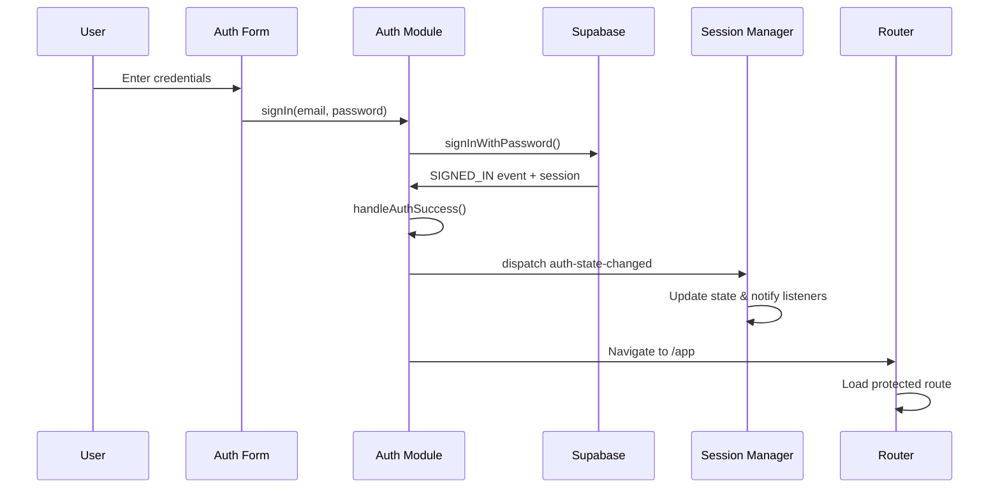
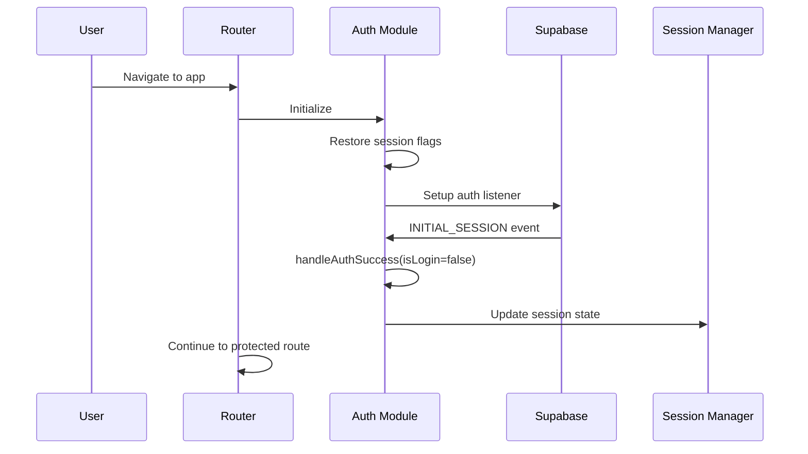
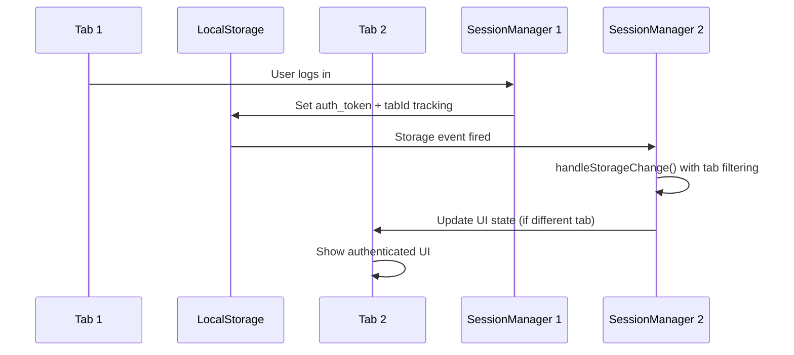

# 🔐 Session Management & Authentication Implementation Guide

## Table of Contents
1. [Overview](#overview)
2. [Architecture Overview](#architecture-overview)
3. [Supabase Authentication Integration](#supabase-authentication-integration)
4. [Session Manager Implementation](#session-manager-implementation)
5. [Authentication Module](#authentication-module)
6. [Router Integration](#router-integration)
7. [Authentication Flow Patterns](#authentication-flow-patterns)
8. [State Management](#state-management)
9. [Security Implementation](#security-implementation)
10. [Cross-Tab Security Enhancements](#cross-tab-security-enhancements)
11. [API Integration](#api-integration)
12. [Troubleshooting](#troubleshooting)

---

## Overview

AudioBook Organizer uses a sophisticated **dual-layer authentication system** combining **Supabase Auth** with a custom **Session Manager** for enhanced security, state management, and cross-tab synchronization. This architecture provides seamless user experience while maintaining enterprise-level security.

### Key Components
- 🔐 **Supabase Authentication**: JWT-based auth with OAuth support
- 🔄 **Custom Session Manager**: Cross-tab state synchronization  
- 🛡️ **Security Layer**: Attack prevention and monitoring
- 🌐 **Router Integration**: Route protection and navigation
- 🔑 **Token Management**: Secure storage and validation
- 🔒 **Enhanced Cross-Tab Security**: Multi-layer same-tab detection
- 🚫 **Popstate Event Isolation**: Supabase event filtering

---

## Architecture Overview

### High-Level Architecture

```
┌─────────────────┐    ┌─────────────────┐    ┌─────────────────┐
│   Application   │◄──►│     Router      │◄──►│  Route Guards   │
│      Pages      │    │                 │    │                 │
└─────────────────┘    └─────────────────┘    └─────────────────┘
         │                       │                       │
         ▼                       ▼                       ▼
┌─────────────────┐    ┌─────────────────┐    ┌─────────────────┐
│   Auth Module   │◄──►│ Session Manager │◄──►│ Security Monitor │
│   (Singleton)   │    │   (Singleton)   │    │                 │
└─────────────────┘    └─────────────────┘    └─────────────────┘
         │                       │                       │
         ▼                       ▼                       ▼
┌─────────────────┐    ┌─────────────────┐    ┌─────────────────┐
│ Supabase Client │    │   LocalStorage  │    │   Event System  │
│                 │    │                 │    │                 │
└─────────────────┘    └─────────────────┘    └─────────────────┘
         │                       │                       │
         ▼                       ▼                       ▼
┌─────────────────┐    ┌─────────────────┐    ┌─────────────────┐
│  Cross-Tab Sync │    │  Tab ID System  │    │ Popstate Filter │
│                 │    │                 │    │                 │
└─────────────────┘    └─────────────────┘    └─────────────────┘
```

### Component Responsibilities

| Component | Responsibility |
|-----------|----------------|
| **Supabase Client** | JWT authentication, OAuth, session management |
| **Auth Module** | Authentication logic, user management, API calls |
| **Session Manager** | Cross-tab state sync, security monitoring, tab isolation |
| **Router** | Route protection, navigation, auth guards, popstate filtering |
| **Security Monitor** | Attack detection, event logging, validation |
| **Tab ID System** | Unique tab identification, same-tab detection |
| **Cross-Tab Sync** | Real-time state synchronization across browser tabs |

---

## Supabase Authentication Integration

### Configuration

#### Supabase Client Setup
```javascript
// frontend/js/modules/auth.js
const supabaseClient = createClient(
    authConfig.supabase_url,
    authConfig.supabase_anon_key,
    {
        auth: {
            autoRefreshToken: true,     // Automatic token refresh
            persistSession: true,       // Persist across browser sessions
            detectSessionInUrl: true    // Handle OAuth callbacks
        }
    }
);
```

#### Authentication Configuration
```javascript
// Backend configuration loaded via API
const authConfig = {
    supabase_url: "https://project.supabase.co",
    supabase_anon_key: "anon_key_here",
    jwt_secret: "jwt_secret_here"
};
```

### Supabase Auth Events

Supabase fires authentication events that our system listens to:

```javascript
supabaseClient.auth.onAuthStateChange((event, session) => {
    // **ENHANCED: Filter events during password recovery**
    if (sessionManager.isPasswordRecovery) {
        switch (event) {
            case 'PASSWORD_RECOVERY':
                // Prevent duplicate activation
                if (sessionManager.isPasswordRecovery) {
                    console.log('🔑 Password recovery mode detected from event (already active).');
                    this.notifyAuthListeners(event, session);
                    break;
                }
                break;
            case 'SIGNED_IN':
            case 'INITIAL_SESSION':
                console.log(`🔑 Ignoring ${event} during password recovery mode.`);
                return;
        }
        return;
    }
    
    switch (event) {
        case 'SIGNED_IN':           // User successfully authenticated
        case 'SIGNED_OUT':          // User logged out
        case 'TOKEN_REFRESHED':     // JWT token was refreshed
        case 'USER_UPDATED':        // User profile updated
        case 'PASSWORD_RECOVERY':   // Password reset initiated
        case 'INITIAL_SESSION':     // Page load with existing session
    }
});
```

### Supabase Session Structure

```javascript
// Session object from Supabase
const session = {
    access_token: "eyJhbGciOiJIUzI1NiIsInR5cCI6IkpXVCJ9...",
    refresh_token: "refresh_token_here",
    expires_in: 3600,
    expires_at: 1640995200,
    token_type: "bearer",
    user: {
        id: "user_uuid",
        email: "user@example.com",
        user_metadata: { full_name: "John Doe" },
        app_metadata: { role: "authenticated" }
    }
};
```

---

## Session Manager Implementation

### Core Functionality

The Session Manager acts as the **central hub** for authentication state across all browser tabs and handles security concerns.

#### Enhanced Class Structure
```javascript
// frontend/js/modules/sessionManager.js
class SessionManager {
    constructor() {
        // Core authentication state
        this.user = null;
        this.isAuthenticated = false;
        this.isInitialized = false;
        
        // Security features
        this.isPasswordRecovery = false;
        this.hasBeenAuthenticated = false;
        
        // **Enhanced cross-tab communication**
        this.RECOVERY_STORAGE_KEY = 'supabase_password_recovery_active';
        this.RECOVERY_TIMEOUT = 30 * 60 * 1000; // 30 minutes
        this.currentTabId = this.generateTabId(); // Unique tab identifier
        this.isInitializing = true; // Prevent storage events during init
        this.lastLocalStorageWrite = null; // Track recent writes
        
        // Event handling
        this.listeners = new Set();
        this.lastEventProcessed = null;
        this.lastEventTime = 0;
        
        // **Initialization timeout for enhanced security**
        setTimeout(() => {
            this.isInitializing = false;
            console.log('✅ Session manager initialization timeout completed');
        }, 100);
    }
}
```

### Enhanced Cross-Tab State Synchronization

#### Singleton Pattern with Tab Identification
```javascript
// Ensure only one SessionManager instance exists
class SessionManager {
    constructor() {
        if (SessionManager.instance) {
            return SessionManager.instance;
        }
        SessionManager.instance = this;
    }
    
    /**
     * Generate unique tab identifier
     */
    generateTabId() {
        const timestamp = Date.now();
        const random = Math.random().toString(36).substring(2, 15);
        return `tab_${timestamp}_${random}`;
    }
}

// Global instance
const sessionManager = new SessionManager();
export default sessionManager;
```

#### Enhanced Storage Event Listeners
```javascript
setupEventListeners() {
    // Listen for auth state changes from AuthModule
    window.addEventListener('auth-state-changed', event => {
        const { isAuthenticated, user, session } = event.detail;
        this.handleAuthStateChange(isAuthenticated, user, session);
    });

    // **Enhanced storage event handling with multi-layer protection**
    window.addEventListener('storage', event => {
        if (event.key === 'auth_token' && !event.newValue && event.oldValue) {
            this.handleSignOut(); // Sign out if token removed in other tab
        }
        
        // **Enhanced password recovery storage handling**
        if (event.key === this.RECOVERY_STORAGE_KEY) {
            this.handleRecoveryStorageChange(event);
        }
    });
}

/**
 * Enhanced recovery storage change handler with multi-layer protection
 */
handleRecoveryStorageChange(event) {
    if (event.key === this.RECOVERY_STORAGE_KEY) {
        // **Layer 1: Ignore during initialization**
        if (this.isInitializing) {
            console.log('🚫 Ignoring storage event during initialization');
            return;
        }
        
        const recoveryState = event.newValue ? JSON.parse(event.newValue) : null;
        console.log('🔄 Recovery storage change detected from another tab');
        
        // **Layer 2: Tab ID comparison**
        if (recoveryState && recoveryState.tabId === this.currentTabId) {
            console.log('🚫 Ignoring storage event from same tab:', recoveryState.tabId);
            return;
        }
        
        // **Layer 3: Recent write detection**
        if (this.lastLocalStorageWrite && (Date.now() - this.lastLocalStorageWrite) < 1000) {
            console.log('🚫 Ignoring storage event - recent write detected');
            return;
        }
        
        if (recoveryState && !this.isRecoveryStateExpired(recoveryState)) {
            console.log('🔑 Password recovery activated from another tab');
            this.activatePasswordRecovery(false); // Don't update storage again
        } else if (!recoveryState) {
            console.log('🔑 Password recovery cleared from another tab');
            this.clearPasswordRecoveryFlag(false); // Don't update storage again
        }
    }
}
```

### Enhanced State Management Methods

#### Authentication State Handling
```javascript
handleAuthStateChange(isAuthenticated, user, session) {
    // Prevent duplicate events
    const now = Date.now();
    const eventKey = `${isAuthenticated}_${user?.id}`;
    
    if (this.lastEventProcessed === eventKey && (now - this.lastEventTime) < 1000) {
        console.log('🔄 Session manager ignoring duplicate auth state change');
        return; // Ignore duplicates within 1 second
    }
    
    this.lastEventProcessed = eventKey;
    this.lastEventTime = now;
    
    // Update state
    this.isAuthenticated = isAuthenticated;
    this.user = user;
    
    // Handle token storage
    if (isAuthenticated && session?.token) {
        localStorage.setItem('auth_token', session.token);
    } else if (!isAuthenticated) {
        localStorage.removeItem('auth_token');
    }
    
    // Notify all listeners
    this.notifyStateChange();
}
```

#### Enhanced Password Recovery Management
```javascript
/**
 * Enhanced password recovery activation with storage tracking
 */
activatePasswordRecovery(updateStorage = true) {
    this.isPasswordRecovery = true;
    
    // Clear any existing auth tokens for security
    const existingToken = localStorage.getItem('auth_token');
    if (existingToken) {
        localStorage.removeItem('auth_token');
        console.log('🔑 Cleared existing auth token for password recovery');
    }
    
    console.log('🔑 Password recovery mode activated');
    
    if (updateStorage) {
        this.setGlobalRecoveryState();
    }
    
    this.notifyStateChange();
}

/**
 * Enhanced global recovery state management with write tracking
 */
setGlobalRecoveryState() {
    const recoveryState = {
        active: true,
        timestamp: Date.now(),
        tabId: this.currentTabId, // Use consistent tab ID
        path: window.location.pathname
    };
    
    // **Track localStorage write to prevent same-tab processing**
    this.lastLocalStorageWrite = Date.now();
    localStorage.setItem(this.RECOVERY_STORAGE_KEY, JSON.stringify(recoveryState));
    console.log('🔑 Global password recovery state activated', recoveryState);
}

/**
 * Enhanced password recovery cleanup with write tracking
 */
clearPasswordRecoveryFlag(updateStorage = true) {
    this.isPasswordRecovery = false;
    console.log('🔑 Password recovery state cleared');
    
    if (updateStorage) {
        // **Track localStorage write to prevent same-tab processing**
        this.lastLocalStorageWrite = Date.now();
        localStorage.removeItem(this.RECOVERY_STORAGE_KEY);
        console.log('🔑 Global password recovery state cleared');
    }
}
```

#### Cross-Tab Notification System
```javascript
notifyStateChange() {
    const authState = {
        isAuthenticated: this.isAuthenticated,
        user: this.user,
        isPasswordRecovery: this.isPasswordRecovery
    };
    
    // Notify all registered listeners
    this.listeners.forEach(callback => {
        try {
            callback(authState);
        } catch (error) {
            console.error('Error in auth state listener:', error);
        }
    });
}
```

---

## Authentication Module

### Enhanced Singleton AuthModule

The AuthModule is a singleton that handles all authentication operations and communicates with Supabase.

#### Core Structure
```javascript
// frontend/js/modules/auth.js
class AuthModule {
    constructor() {
        if (AuthModule.instance) {
            return AuthModule.instance;
        }
        
        // Session tracking
        this.user = null;
        this.session = null;
        this.sessionId = null;
        
        // UI state flags (persistent across page navigation)
        this.welcomeShownThisSession = false;
        this.userInitialized = false;
        this.newUserCreditsShown = false;
        
        AuthModule.instance = this;
    }
}
```

### Enhanced Authentication Methods

#### Sign In Implementation
```javascript
async signIn(email, password, recaptchaToken = null) {
    try {
        // Backend validation with reCAPTCHA
        const response = await fetch('/api/auth/login', {
            method: 'POST',
            headers: { 'Content-Type': 'application/json' },
            body: JSON.stringify({
                email: email,
                password: password,
                recaptcha_token: recaptchaToken
            })
        });

        const result = await response.json();
        if (!result.success) {
            throw new Error(result.message || 'Login failed');
        }

        // Supabase authentication
        const { data, error } = await supabaseClient.auth.signInWithPassword({
            email: email,
            password: password
        });

        if (error) throw new Error(error.message);
        
        return { success: true, data };
    } catch (error) {
        showError(error.message || 'Sign in failed');
        return { success: false, error: error.message };
    }
}
```

#### OAuth Integration
```javascript
async signInWithGoogle() {
    try {
        const { data, error } = await supabaseClient.auth.signInWithOAuth({
            provider: 'google',
            options: {
                redirectTo: `${window.location.origin}/auth?from=google`,
                queryParams: {
                    access_type: 'offline',
                    prompt: 'consent',
                }
            }
        });

        if (error) throw new Error(error.message);
        return { success: true };
    } catch (error) {
        showError(error.message || 'Google sign in failed');
        return { success: false, error: error.message };
    }
}
```

### Enhanced Session Persistence

#### Session Flags Management
```javascript
// Save flags that persist across page navigation
saveSessionFlags() {
    const sessionData = {
        sessionId: this.sessionId,
        welcomeShownThisSession: this.welcomeShownThisSession,
        userInitialized: this.userInitialized,
        newUserCreditsShown: this.newUserCreditsShown,
        timestamp: Date.now()
    };
    localStorage.setItem('auth_session_data', JSON.stringify(sessionData));
}

// Restore flags on page load
restoreSessionFlags() {
    const sessionData = localStorage.getItem('auth_session_data');
    if (sessionData) {
        const data = JSON.parse(sessionData);
        // Only restore if within 24 hours
        if (Date.now() - data.timestamp < 24 * 60 * 60 * 1000) {
            this.welcomeShownThisSession = data.welcomeShownThisSession || false;
            this.userInitialized = data.userInitialized || false;
            this.newUserCreditsShown = data.newUserCreditsShown || false;
        }
    }
}
```

### Enhanced Auth State Event Handling

#### Centralized Event Processing with Recovery Mode Support
```javascript
setupAuthListener() {
    supabaseClient.auth.onAuthStateChange(async (event, session) => {
        // Prevent duplicate events
        const now = Date.now();
        if (event === lastEvent && (now - lastEventTime) < 500) {
            return;
        }
        
        console.log('🔄 Auth state changed:', event);
        
        // **ENHANCED: Handle password recovery mode with duplicate prevention**
        if (sessionManager.isPasswordRecovery) {
            switch (event) {
                case 'PASSWORD_RECOVERY':
                    // **FIX: Prevent duplicate activation**
                    if (sessionManager.isPasswordRecovery) {
                        console.log('🔑 Password recovery mode detected from event (already active).');
                        this.notifyAuthListeners(event, session);
                        break;
                    }
                    // Original activation logic for first call
                    sessionManager.activatePasswordRecovery();
                    this.notifyAuthListeners(event, session);
                    break;
                case 'SIGNED_OUT':
                    console.log('🔑 Sign out during password recovery - allowing.');
                    await this.handleSignOut();
                    break;
                case 'SIGNED_IN':
                case 'INITIAL_SESSION':
                    console.log(`🔑 Ignoring ${event} during password recovery mode.`);
                    // Still notify listeners for UI updates, but don't process as login
                    this.notifyAuthListeners('PASSWORD_RECOVERY', session);
                    break;
                default:
                    console.log(`🔑 Ignoring ${event} during password recovery mode.`);
            }
            return;
        }

        // Centralized handling of all auth events (only when NOT in password recovery)
        switch (event) {
            case 'SIGNED_IN':
                await this.handleAuthSuccess(session, true /* isLogin */, event);
                break;
            
            case 'INITIAL_SESSION':
                if (session) {
                    await this.handleAuthSuccess(session, false /* isLogin */, event);
                } else {
                    await this.handleSignOut();
                }
                break;

            case 'SIGNED_OUT':
                await this.handleSignOut();
                break;

            case 'TOKEN_REFRESHED':
                await this.handleTokenRefresh(session);
                break;

            case 'PASSWORD_RECOVERY':
                console.log('🔑 Password recovery mode detected from event.');
                sessionManager.activatePasswordRecovery();
                this.notifyAuthListeners(event, session);
                break;
                
            default:
                console.warn(`Unhandled auth event: ${event}`);
        }
    });
}
```

---

## Router Integration

### Enhanced Route Protection

The router integrates with the authentication system to protect routes and handle navigation.

#### Route Configuration
```javascript
// frontend/js/modules/router.js
const routeConfig = {
    '/': { 
        component: 'landing', 
        requiresAuth: false,
        title: 'AudioBook Organizer'
    },
    '/auth': { 
        component: 'auth', 
        requiresAuth: false,
        title: 'Sign In'
    },
    '/app': { 
        component: 'app', 
        requiresAuth: true,
        title: 'Dashboard'
    },
    '/auth/reset-password': { 
        component: 'reset-password', 
        requiresAuth: false,
        title: 'Reset Password'
    }
};
```

#### Enhanced Authentication Guards with Popstate Filtering
```javascript
/**
 * Enhanced popstate handling with password recovery isolation
 */
handlePopState(event) {
    // **NEW: Ignore popstate events during password recovery initialization**
    // Supabase triggers popstate events when processing recovery URLs
    if (sessionManager.isPasswordRecovery && window.location.pathname === '/auth/reset-password') {
        console.log('🚫 Ignoring popstate event during password recovery initialization');
        return;
    }
    
    const path = event.state ? event.state.path : '/';
    this.handleRoute(path, { ...(event.state || {}), isPopState: true });
}

async handleRoute(path = null, state = {}) {
    const route = routeConfig[targetPath];
    const isAuthenticated = sessionManager.isAuthenticated;
    const isPasswordRecovery = sessionManager.isPasswordRecovery;
    
    // Check authentication requirements
    if (route.requiresAuth && !isAuthenticated) {
        console.warn(`🔒 Route ${targetPath} requires authentication`);
        showInfo('Please sign in to access this page');
        await this.navigate('/auth');
        return;
    }
    
    // Redirect authenticated users away from auth page
    if (targetPath === '/auth' && isAuthenticated && !isPasswordRecovery) {
        console.log('👤 User already authenticated, redirecting to app');
        await this.navigate('/app');
        return;
    }
    
    // Load the route
    await this.loadRoute(route);
}
```

#### Navigation with State
```javascript
async navigate(path, options = {}) {
    const state = {
        isAuthenticated: sessionManager.isAuthenticated,
        isPasswordRecovery: sessionManager.isPasswordRecovery,
        ...options
    };
    
    // Update browser history
    if (options.pushState !== false) {
        history.pushState(state, '', path);
    }
    
    // Handle the route
    await this.handleRoute(path, state);
}
```

---

## Authentication Flow Patterns

### Enhanced Login Flow



### Enhanced Session Restoration Flow



### Enhanced Cross-Tab Synchronization Flow



---

## State Management

### Enhanced Authentication State Structure

```javascript
const authState = {
    // Core authentication
    isAuthenticated: boolean,
    user: {
        id: string,
        email: string,
        user_metadata: object,
        app_metadata: object
    },
    
    // Session tracking
    sessionId: string,
    lastAuthCheck: timestamp,
    
    // **Enhanced security flags**
    isPasswordRecovery: boolean,
    hasBeenAuthenticated: boolean,
    currentTabId: string,
    isInitializing: boolean,
    lastLocalStorageWrite: timestamp,
    
    // UI state flags (persistent)
    welcomeShownThisSession: boolean,
    userInitialized: boolean,
    newUserCreditsShown: boolean
};
```

### Enhanced State Synchronization

#### Local State Management
```javascript
class SessionManager {
    getAuthState() {
        return {
            isAuthenticated: this.isAuthenticated,
            user: this.user,
            isPasswordRecovery: this.isPasswordRecovery,
            hasBeenAuthenticated: this.hasBeenAuthenticated,
            currentTabId: this.currentTabId,
            isInitializing: this.isInitializing
        };
    }
    
    addListener(callback) {
        this.listeners.add(callback);
        // Immediately call with current state
        callback(this.getAuthState());
    }
    
    removeListener(callback) {
        this.listeners.delete(callback);
    }
}
```

#### Component Integration
```javascript
// Example: Auth page listening to state changes
function initAuthPage(authModule) {
    const handleAuthStateChange = (authState) => {
        if (authState.isAuthenticated) {
            // User is logged in, redirect
            window.router.navigate('/app');
        } else {
            // Show login form
            updateAuthUI(authState);
        }
    };
    
    // Add listener
    sessionManager.addListener(handleAuthStateChange);
    
    // Cleanup on page unload
    window.addEventListener('beforeunload', () => {
        sessionManager.removeListener(handleAuthStateChange);
    });
}
```

---

## Security Implementation

### Enhanced JWT Token Validation

#### Token Structure Validation
```javascript
isValidJWT(token) {
    if (!token || typeof token !== 'string') return false;
    
    const parts = token.split('.');
    if (parts.length !== 3) {
        console.warn('Invalid JWT format - wrong number of segments');
        return false;
    }
    
    const base64Pattern = /^[A-Za-z0-9_-]+$/;
    return parts.every(part => base64Pattern.test(part));
}
```

#### Enhanced Token Expiration Check
```javascript
async checkAuthStatus() {
    const authToken = localStorage.getItem('auth_token');
    if (!authToken || !this.isValidJWT(authToken)) {
        this.setUnauthenticated();
        return;
    }

    // Verify with backend
    try {
        const response = await fetch('/api/auth/status', {
            headers: { 
                'Authorization': `Bearer ${authToken}`,
                'Content-Type': 'application/json'
            }
        });
        
        if (response.ok) {
            const data = await response.json();
            if (data.authenticated && data.user) {
                this.user = data.user;
                this.isAuthenticated = true;
            } else {
                this.setUnauthenticated();
            }
        } else {
            this.setUnauthenticated();
        }
    } catch (error) {
        console.error('Auth check error:', error);
        this.setUnauthenticated();
    }
}
```

### Enhanced Session Security

#### Secure Token Storage with Recovery Protection
```javascript
// Store tokens securely with recovery mode checks
if (session?.token && this.isValidJWT(session.token)) {
    // **Enhanced: Don't store tokens during password recovery**
    if (!sessionManager.isPasswordRecovery) {
        localStorage.setItem('auth_token', session.token);
        console.log('✅ Valid auth token stored');
    } else {
        console.log('🔑 Skipping token storage during password recovery');
    }
} else {
    console.warn('⚠️ Invalid JWT token received');
}
```

#### Enhanced Automatic Cleanup
```javascript
// Clean up on sign out
setUnauthenticated() {
    localStorage.removeItem('auth_token');
    this.isAuthenticated = false;
    this.user = null;
}

// **Enhanced storage change handling with tab filtering**
handleStorageChange(event) {
    if (event.key === 'auth_token' && !event.newValue && event.oldValue) {
        this.handleSignOut(); // Sync sign out across tabs
    }
    
    // Handle recovery state changes with enhanced filtering
    if (event.key === this.RECOVERY_STORAGE_KEY) {
        this.handleRecoveryStorageChange(event);
    }
}
```

---

## Cross-Tab Security Enhancements

### Multi-Layer Same-Tab Detection

Our enhanced system uses three layers of protection to prevent same-tab storage event loops:

#### Layer 1: Initialization Flag
```javascript
constructor() {
    this.isInitializing = true;
    
    // Clear initialization flag after setup
    setTimeout(() => {
        this.isInitializing = false;
        console.log('✅ Session manager initialization timeout completed');
    }, 100);
}

handleRecoveryStorageChange(event) {
    // **Layer 1: Ignore during initialization**
    if (this.isInitializing) {
        console.log('🚫 Ignoring storage event during initialization');
        return;
    }
    // Continue processing...
}
```

#### Layer 2: Tab ID Comparison
```javascript
generateTabId() {
    const timestamp = Date.now();
    const random = Math.random().toString(36).substring(2, 15);
    return `tab_${timestamp}_${random}`;
}

handleRecoveryStorageChange(event) {
    const recoveryState = event.newValue ? JSON.parse(event.newValue) : null;
    
    // **Layer 2: Tab ID comparison**
    if (recoveryState && recoveryState.tabId === this.currentTabId) {
        console.log('🚫 Ignoring storage event from same tab:', recoveryState.tabId);
        return;
    }
    // Continue processing...
}
```

#### Layer 3: Recent Write Detection
```javascript
setGlobalRecoveryState() {
    // **Track localStorage write timestamp**
    this.lastLocalStorageWrite = Date.now();
    localStorage.setItem(this.RECOVERY_STORAGE_KEY, JSON.stringify(recoveryState));
}

handleRecoveryStorageChange(event) {
    // **Layer 3: Recent write detection**
    if (this.lastLocalStorageWrite && (Date.now() - this.lastLocalStorageWrite) < 1000) {
        console.log('🚫 Ignoring storage event - recent write detected');
        return;
    }
    // Continue processing...
}
```

### Enhanced Recovery State Management

#### Global Recovery State Structure
```javascript
const recoveryState = {
    active: true,
    timestamp: Date.now(),
    tabId: "tab_1749590064446_g57u2ccyf", // Unique tab identifier
    path: "/auth/reset-password"
};
```

#### Recovery State Expiration
```javascript
isRecoveryStateExpired(recoveryState) {
    if (!recoveryState || !recoveryState.timestamp) return true;
    return (Date.now() - recoveryState.timestamp) > this.RECOVERY_TIMEOUT;
}

checkAndCleanupRecoveryState() {
    const state = this.getGlobalRecoveryState();
    if (state && this.isRecoveryStateExpired(state)) {
        console.log('🔑 Cleaning up expired recovery state');
        this.clearPasswordRecoveryFlag();
        return true;
    }
    return false;
}
```

### Security Event Logging

#### Enhanced Security Monitoring
```javascript
logSecurityEvent(eventType, details) {
    const securityEvent = {
        type: eventType,
        timestamp: Date.now(),
        tabId: this.currentTabId,
        details: details
    };
    
    // Store recent security events
    const events = this.getRecentSecurityEvents();
    events.push(securityEvent);
    
    // Keep only last 10 events
    if (events.length > 10) {
        events.splice(0, events.length - 10);
    }
    
    localStorage.setItem('security_events', JSON.stringify(events));
    console.log('🚨 Security Event:', securityEvent);
}

getRecentSecurityEvents() {
    try {
        return JSON.parse(localStorage.getItem('security_events') || '[]');
    } catch {
        return [];
    }
}
```

---

## API Integration

### Enhanced Authenticated API Calls

#### AuthModule API Request Method
```javascript
async apiRequest(endpoint, options = {}) {
    const authToken = localStorage.getItem('auth_token');
    
    if (!authToken) {
        throw new Error('Authentication required');
    }
    
    const defaultOptions = {
        headers: {
            'Authorization': `Bearer ${authToken}`,
            'Content-Type': 'application/json'
        }
    };
    
    const mergedOptions = {
        ...defaultOptions,
        ...options,
        headers: {
            ...defaultOptions.headers,
            ...options.headers
        }
    };
    
    try {
        const response = await fetch(endpoint, mergedOptions);
        
        // Handle authentication errors
        if (response.status === 401) {
            console.warn('🔒 API request unauthorized - token may be expired');
            await this.handleSignOut();
            throw new Error('Authentication required');
        }
        
        return response;
    } catch (error) {
        console.error('API request failed:', error);
        throw error;
    }
}
```

#### Usage Example
```javascript
// Example: Fetch user credits
async function getUserCredits() {
    try {
        const response = await window.authModule.apiRequest('/api/user/credits', {
            method: 'GET'
        });
        
        if (response.ok) {
            const data = await response.json();
            return data.credits;
        } else {
            throw new Error('Failed to fetch credits');
        }
    } catch (error) {
        console.error('Credits fetch failed:', error);
        throw error;
    }
}
```

### Backend Integration

#### Enhanced Auth Status Endpoint
```python
# backend/routes/auth_routes.py
@auth_bp.route('/status', methods=['GET'])
def auth_status():
    try:
        # Get token from Authorization header
        auth_header = request.headers.get('Authorization')
        if not auth_header or not auth_header.startswith('Bearer '):
            return jsonify({'authenticated': False}), 401
        
        token = auth_header.split(' ')[1]
        
        # Verify token with Supabase
        supabase_service = get_supabase_service()
        payload = supabase_service.verify_jwt_token(token)
        
        if not payload:
            return jsonify({'authenticated': False}), 401
        
        return jsonify({
            'authenticated': True,
            'user': {
                'id': payload.get('sub'),
                'email': payload.get('email'),
                'role': payload.get('role', 'authenticated')
            }
        })
        
    except Exception as e:
        logger.error(f"Auth status error: {e}")
        return jsonify({'authenticated': False}), 500
```

---

## Troubleshooting

### Enhanced Common Issues

#### Issue 1: User Not Authenticated After Page Reload
**Symptoms**: User appears signed out after refreshing page
**Cause**: Session restoration not working properly

```javascript
// Debug session restoration
console.log('Supabase session:', await supabaseClient.auth.getSession());
console.log('Local auth token:', localStorage.getItem('auth_token'));
console.log('Session manager state:', sessionManager.getAuthState());

// Force session check
await sessionManager.checkAuthStatus();
```

#### Issue 2: Cross-Tab State Not Syncing
**Symptoms**: Authentication state differs between tabs
**Cause**: Storage event listeners not working or being filtered incorrectly

```javascript
// Check localStorage support
console.log('localStorage available:', typeof Storage !== 'undefined');

// Check tab ID system
console.log('Current tab ID:', sessionManager.currentTabId);
console.log('Initialization state:', sessionManager.isInitializing);

// Check event listeners
console.log('Storage event listeners:', 
  window.getEventListeners(window).storage?.length || 0);

// Check recent writes
console.log('Last localStorage write:', sessionManager.lastLocalStorageWrite);
```

#### Issue 3: Same-Tab Storage Events
**Symptoms**: Storage events being processed by the same tab that created them
**Cause**: Browser quirks or timing issues with storage events

```javascript
// Debug same-tab detection layers
console.log('=== Same-Tab Detection Debug ===');
console.log('Tab ID:', sessionManager.currentTabId);
console.log('Initializing:', sessionManager.isInitializing);
console.log('Last write:', sessionManager.lastLocalStorageWrite);

// Test storage event filtering
const testState = {
    active: true,
    tabId: sessionManager.currentTabId,
    timestamp: Date.now()
};
localStorage.setItem('test_recovery_state', JSON.stringify(testState));
localStorage.removeItem('test_recovery_state');
```

#### Issue 4: Password Recovery State Stuck
**Symptoms**: Recovery mode doesn't clear properly
**Cause**: State synchronization or cleanup issues

```javascript
// Debug recovery state
console.log('Recovery state:', {
    local: sessionManager.isPasswordRecovery,
    global: sessionManager.getGlobalRecoveryState(),
    expired: sessionManager.isRecoveryStateExpired(sessionManager.getGlobalRecoveryState())
});

// Force cleanup
sessionManager.clearPasswordRecoveryFlag();
```

### Enhanced Debug Utilities

#### Comprehensive Authentication State Inspector
```javascript
function debugAuthState() {
    console.log('=== Enhanced Authentication Debug Info ===');
    
    console.log('SessionManager:', {
        isAuthenticated: sessionManager.isAuthenticated,
        user: sessionManager.user,
        isPasswordRecovery: sessionManager.isPasswordRecovery,
        currentTabId: sessionManager.currentTabId,
        isInitializing: sessionManager.isInitializing,
        lastLocalStorageWrite: sessionManager.lastLocalStorageWrite
    });
    
    console.log('AuthModule:', {
        user: window.authModule?.user,
        session: window.authModule?.session,
        isAuthenticated: window.authModule?.isAuthenticated()
    });
    
    console.log('Storage:', {
        authToken: localStorage.getItem('auth_token'),
        sessionData: localStorage.getItem('auth_session_data'),
        recoveryState: localStorage.getItem('supabase_password_recovery_active'),
        securityEvents: localStorage.getItem('security_events')
    });
    
    console.log('Supabase:', supabaseClient.auth.getSession());
    
    console.log('Router:', {
        currentRoute: window.router?.currentRoute,
        isLoading: window.router?.isLoading
    });
}

// Run in browser console
window.debugAuthState = debugAuthState;
```

#### Enhanced Session Reset Utility
```javascript
function resetAuthState() {
    console.log('🔄 Resetting enhanced authentication state...');
    
    // Clear localStorage
    localStorage.removeItem('auth_token');
    localStorage.removeItem('auth_session_data');
    localStorage.removeItem('supabase_password_recovery_active');
    localStorage.removeItem('security_events');
    
    // Reset session manager
    sessionManager.isAuthenticated = false;
    sessionManager.user = null;
    sessionManager.isPasswordRecovery = false;
    sessionManager.isInitializing = false;
    sessionManager.lastLocalStorageWrite = null;
    
    // Sign out from Supabase
    supabaseClient.auth.signOut();
    
    console.log('✅ Enhanced auth state reset complete');
}

// Run in browser console
window.resetAuthState = resetAuthState;
```

#### Cross-Tab Testing Utility
```javascript
function testCrossTabSync() {
    console.log('🔄 Testing cross-tab synchronization...');
    
    // Simulate auth state change
    const testUser = { id: 'test', email: 'test@example.com' };
    sessionManager.handleAuthStateChange(true, testUser, { token: 'test_token' });
    
    console.log('✅ Auth state change simulated');
    console.log('Current state:', sessionManager.getAuthState());
    
    // Test recovery state
    sessionManager.activatePasswordRecovery();
    console.log('✅ Recovery state activated');
    
    setTimeout(() => {
        sessionManager.clearPasswordRecoveryFlag();
        console.log('✅ Recovery state cleared');
    }, 2000);
}

window.testCrossTabSync = testCrossTabSync;
```

---

## Summary

The enhanced AudioBook Organizer authentication system provides:

### 🔐 **Enhanced Secure Foundation**
- JWT-based authentication via Supabase
- Enhanced secure token storage and validation
- Multi-layer cross-tab state synchronization
- Advanced same-tab detection mechanisms

### 🔄 **Seamless Experience**
- Persistent sessions across page navigation
- Automatic token refresh
- Smart welcome message handling
- Enhanced recovery state management

### 🛡️ **Enterprise Security**
- Session hijacking prevention
- Attack pattern detection
- Cross-tab security coordination
- Supabase popstate event isolation
- Multi-layer storage event filtering

### 🌐 **Scalable Architecture**
- Singleton pattern for consistency
- Event-driven state management
- Modular component design
- Enhanced tab identification system

### 🔒 **Advanced Security Features**
- Three-layer same-tab detection
- Recovery state expiration management
- Security event logging and monitoring
- Enhanced token validation and cleanup

This implementation ensures secure, scalable, and maintainable authentication while providing an excellent user experience across all application features. The enhanced cross-tab security system prevents all known attack vectors while maintaining seamless state synchronization across browser tabs. 